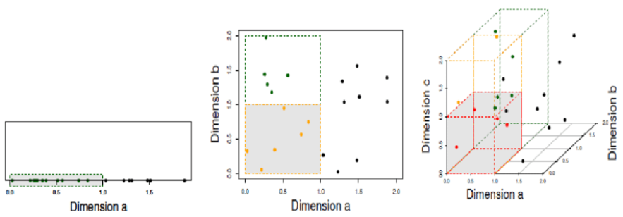
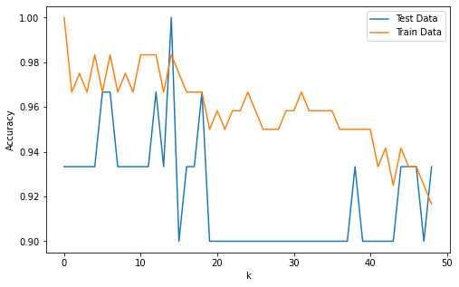

# KNN algorithm

KNN 알고리즘은 K-nearest neighbor의 줄인 말로 Classification기법 중 하나이다. 점 A가 어느 집단에 속할 지 결정하는 문제를 상상해보자. 사람이라면 눈으로 보기에 괜찮다 싶을 정도의 구분 선을 그을 수 있겠지만 이와 같은 예시에서 자동화된 분류를 하려면 어떻게 알고리즘을 짜야 할까? 직관적으로 하나의 점에 대해 다른 점들과의 거리를 모두 계산하여 거리가 가장 가까운 집단을 선택하는 방법을 상상할 수 있다. 바로 이것이 KNN algorithm의 핵심 아이디어로 점을 하나씩 선택하여 어느 클래스에 속할 지를 `거리 기반`으로 계산하여 클래스를 분류한다는 것이다. 


## 알고리즘의 과정

KNN algorithm이 분류를 하는 과정은 다음과 같다.

> 1. 임의의 점 A에 대해 모든 훈련 데이터들과의 거리를 계산한다. 일반적으로 유클리드거리를 사용하지만, Manhattan distance나 Minkowski distance를 사용하기도 한다. 사용하는 거리들의 공식은 아래와 같다. 첨언하자면, Minkowski distance의 경우 많이 떨어진 거리를 부각할 때 사용된다.
>    $$
>    (Euclidean\:distance)= \sqrt{(\sum_{i=1}^{n}(p_{i}-q_{i})^{2})}
>    $$
>
> $$
> (Manhattan\:distance)=\sqrt{\sum_{i=1}^{n}\lvert p_{i}-q_{i}\rvert}
> $$
>
> $$
> (Minkowski\:distance)=\sqrt[m]{\sum_{i=1}^{n}\lvert p_{i}-q_{i}\rvert^{m}}
> $$
>
> 2. 측정한 거리가 작은 순서대로 K개의 점을 찾는다. 이 때 K는 KNN Classifier에서 hyperparameter의 역할을 한다.
> 3. K개의 점들이 속한 클래스를 찾는다.
> 4. K개의 점들이 속한 클래스가 가장 많은 것을 찾는다. 예를 들어 클래스 집합이 {1,1,1,1,2,2,2,4}와 같다면, 클래스 1이 가장 많다고 평가한다.
> 5. 점 A의 클래스를 1로 분류한다.
> 6. 시험 데이터와 비교하여 score를 매기고, 분류가 잘 되었는지 확인한다.
> 7. K값을 바꾸어 가며 가장 정확하게 분류하는 K를 찾는다. 이 때 교차 검정(Cross Validation)방법을 활용할 수 있는데 훈련 데이터와 시험 데이터를 샘플링을 통해 계속 바꾸어 가며 scoring을 하는 방식이다.


## 차원의 저주(Curse of Dimensionality)

KNN Classifier는 훈련 데이터가 많다면 직관적인 만큼 꽤 좋은 성과를 낸다. 그러나 차원(dimension)이 증가하는 경우 성능이 크게 저하된다. 이유는 아래 그림으로 쉽게 설명되는데, 차원이 적을 때 점들의 거리가 멀지 않아 데이터의 개수가 충분하여 Classification이 쉽다. 그러나 차원이 증가하면 점들 사이의 거리가 기하급수적으로 증가하여 한 차원 적은 공간에서 데이터가 충분하더라도 차원이 커지면 그렇지 않을 수 있다. 이는 분류에 있어 치명적인 단점으로 작용하는데, 이 때 해결법은 두가지가 있다.



1. 데이터의 개수를 늘린다.
   - 직관적으로 차원이 늘어나 점들 사이의 거리가 멀어져 분류기가 제대로 작동하지 못하는 것이라면 데이터 자체를 늘려 점들이 군집을 이루게 한 후 분류기를 작동시키는 것이 합리적이다.
2. 차원 자체를 축소한다. (Dimensionality Reduction)
   - Dimension이 너무 많아 문제가 되는 것이라면 이 차원 자체를 축소하여 분류기를 작동시키는 방식을 채택할 수도 있다. 이 방식을 차원 축소(Dimensionality Reduction)라 부르는데 t-SNE나 PCA와 같이 선형 대수적인 방법을 주로 사용한다.


## 코드로 구현해보기(iris datset)

> 필요한 패키지들을 불러온다.

```python
import matplotlib.pyplot as plt
from sklearn.datasets import load_iris
from sklearn.model_selection import train_test_split
from sklearn.neighbors import KNeighborsClassifier
```


> 내장된 iris dataset을 불러온 후 train/test로 분리한다.

```python
iris = load_iris()
print(iris['feature_names']) # feature
print(iris['data']) # feature data
print(iris['target']) # target data

trainX, testX, trainY, testY = \
	train_test_split(iris['data'], iris['target'], test_size= 0.2)
```

```
['sepal length (cm)', 'sepal width (cm)', 'petal length (cm)', 'petal width (cm)']

[[5.1 3.5 1.4 0.2]
 [4.9 3.  1.4 0.2]
 [4.7 3.2 1.3 0.2]
 [4.6 3.1 1.5 0.2]
 [5.  3.6 1.4 0.2]
 [5.4 3.9 1.7 0.4]
 [4.6 3.4 1.4 0.3]
 [5.  3.4 1.5 0.2]
 [4.4 2.9 1.4 0.2]
 [4.9 3.1 1.5 0.1]
 [5.4 3.7 1.5 0.2]
 [4.8 3.4 1.6 0.2]
 
 [0 0 0 0 0 0 0 0 0 0 0 0 0 0 0 0 0 0 0 0 0 0 0 0 0 0 0 0 0 0 0 0 0 0 0 0 0
 0 0 0 0 0 0 0 0 0 0 0 0 0 1 1 1 1 1 1 1 1 1 1 1 1 1 1 1 1 1 1 1 1 1 1 1 1
 1 1 1 1 1 1 1 1 1 1 1 1 1 1 1 1 1 1 1 1 1 1 1 1 1 1 2 2 2 2 2 2 2 2 2 2 2
 2 2 2 2 2 2 2 2 2 2 2 2 2 2 2 2 2 2 2 2 2 2 2 2 2 2 2 2 2 2 2 2 2 2 2 2 2
 2 2]
```


> KNN 분류기를 train 데이터로 학습한다.

```python
knn= KNeighborsClassifier(n_neighbors=5, p=2, metric='minkowski')
# k개수 5, 2의 power를 가진 minkowski거리 사용
knn.fit(trainX, trainY)
```


> 예측값을 추출하고 accuracy를 측정한다.

```python
predY= knn.predict
accuracy= (testY == predY).mean()
print("시험용 데이터로 측정한 정확도 = %.2f" % accuracy)
```

```
시험용 데이터로 측정한 정확도 = 0.93
```

93%정도를 맞춘다는 의미이므로 꽤 성능이 괜찮다.


> k를 변화시켜보면서 정확도를 측정해본다. 또한 그림으로 그려 눈으로 accuracy의 추이를 확인한다.

```python
testAcc = []
trainAcc = []
for k in range(1, 50): # k가 1부터 49까지
    # KNN 으로 Train 데이터 세트를 학습한다.
    knn = KNeighborsClassifier(n_neighbors=k, p=2, metric='minkowski')
    knn.fit(trainX, trainY)
    
    # Test 세트의 Feature에 대한 정확도
    predY = knn.predict(testX)
    testAcc.append((testY == predY).sum() / len(predY))
    
    # Train 세트의 Feature에 대한 정확도
    predY = knn.predict(trainX)
    trainAcc.append((trainY == predY).sum() / len(predY))

plt.figure(figsize=(8, 5))
plt.plot(testAcc, label="Test Data")
plt.plot(trainAcc, label="Train Data")
plt.legend()
plt.xlabel("k")
plt.ylabel("Accuracy")
plt.show()
```




## References

[차원 축소 그림 출처](https://www.researchgate.net/figure/The-curse-of-dimensionality-a-11-objects-in-one-unit-bin-b-6-objects-in-one-unit-bin_fig1_264823819)

[공부 내용 참조 블로그](https://blog.naver.com/chunjein)

