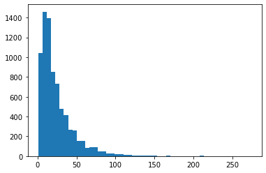
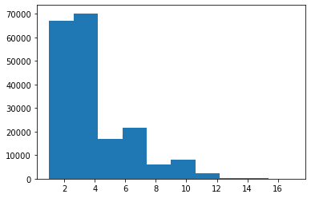
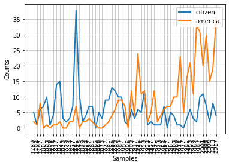
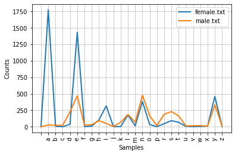

# Corpus List

## Gutenberg corpus

#### gutenberg 코퍼스의 파일 ID들을 조회하기

```python
import nltk

textId= nltk.corpus.gutenberg.fileids()
textId
```

```profile
Out[3]: 
['austen-emma.txt',
 'austen-persuasion.txt',
 'austen-sense.txt',
 'bible-kjv.txt',
 'blake-poems.txt',
 'bryant-stories.txt',
 'burgess-busterbrown.txt',
 'carroll-alice.txt',
 'chesterton-ball.txt',
 'chesterton-brown.txt',
 'chesterton-thursday.txt',
 'edgeworth-parents.txt',
 'melville-moby_dick.txt',
 'milton-paradise.txt',
 'shakespeare-caesar.txt',
 'shakespeare-hamlet.txt',
 'shakespeare-macbeth.txt',
 'whitman-leaves.txt']
```

#### 제인 오스틴의 Emma 텍스트 문서 조회하기

```python
text= nltk.corpus.gutenberg.raw('auten-emma.txt')
print(text[:500])
```

```profile
[Emma by Jane Austen 1816]

VOLUME I

CHAPTER I


Emma Woodhouse, handsome, clever, and rich, with a comfortable home
and happy disposition, seemed to unite some of the best blessings
of existence; and had lived nearly twenty-one years in the world
with very little to distress or vex her.

She was the youngest of the two daughters of a most affectionate,
indulgent father; and had, in consequence of her sister's marriage,
been mistress of his house from a very early period.  Her mother
had died t
```

####  단어, 문장별로 조회하기

```python
# word단위
emma= nltk.corpus.gutenberg.words('austen-emma.txt')
# sentence단위
sentence= nltk.corpus.gutenberg.sents('austen-emma.txt')
```

```python
# 가장 긴 문장 출력해보기
longestLen= max(len(s) for s in sentence)
longestSent= [s for s in sentence if len(s)==longestLen]
print(longestSent)
```

```profile
[['While', 'he', 'lived', ',', 'it', 'must', 'be', 'only', 'an', 'engagement', ';', 'but', 'she', 'flattered', 'herself', ',', 'that', 'if', 'divested', 'of', 'the', 'danger', 'of', 'drawing', 'her', 'away', ',', 'it', 'might', 'become', 'an', 'increase', 'of', 'comfort', 'to', 'him', '.--', 'How', 'to', 'do', 'her', 'best', 'by', 'Harriet', ',', 'was', 'of', 'more', 'difficult', 'decision', ';--', 'how', 'to', 'spare', 'her', 'from', 'any', 'unnecessary', 'pain', ';', 'how', 'to', 'make', 'her', 'any', 'possible', 'atonement', ';', 'how', 'to', 'appear', 'least', 'her', 'enemy', '?--', 'On', 'these', 'subjects', ',', 'her', 'perplexity', 'and', 'distress', 'were', 'very', 'great', '--', 'and', 'her', 'mind', 'had', 'to', 'pass', 'again', 'and', 'again', 'through', 'every', 'bitter', 'reproach', 'and', 'sorrowful', 'regret', 'that', 'had', 'ever', 'surrounded', 'it', '.--', 'She', 'could', 'only', 'resolve', 'at', 'last', ',', 'that', 'she', 'would', 'still', 'avoid', 'a', 'meeting', 'with', 'her', ',', 'and', 'communicate', 'all', 'that', 'need', 'be', 'told', 'by', 'letter', ';', 'that', 'it', 'would', 'be', 'inexpressibly', 'desirable', 'to', 'have', 'her', 'removed', 'just', 'now', 'for', 'a', 'time', 'from', 'Highbury', ',', 'and', '--', 'indulging', 'in', 'one', 'scheme', 'more', '--', 'nearly', 'resolve', ',', 'that', 'it', 'might', 'be', 'practicable', 'to', 'get', 'an', 'invitation', 'for', 'her', 'to', 'Brunswick', 'Square', '.--', 'Isabella', 'had', 'been', 'pleased', 'with', 'Harriet', ';', 'and', 'a', 'few', 'weeks', 'spent', 'in', 'London', 'must', 'give', 'her', 'some', 'amusement', '.--', 'She', 'did', 'not', 'think', 'it', 'in', 'Harriet', "'", 's', 'nature', 'to', 'escape', 'being', 'benefited', 'by', 'novelty', 'and', 'variety', ',', 'by', 'the', 'streets', ',', 'the', 'shops', ',', 'and', 'the', 'children', '.--', 'At', 'any', 'rate', ',', 'it', 'would', 'be', 'a', 'proof', 'of', 'attention', 'and', 'kindness', 'in', 'herself', ',', 'from', 'whom', 'every', 'thing', 'was', 'due', ';', 'a', 'separation', 'for', 'the', 'present', ';', 'an', 'averting', 'of', 'the', 'evil', 'day', ',', 'when', 'they', 'must', 'all', 'be', 'together', 'again', '.']]
```

```python
import matplotlib.pyplot as plt
# 문장 별 단어 개수의 분포 그리기
countWord= [len(n) for n in sentence]
n, bins, patches= plt.hist(countWord, bins=50)

# 단어 당 철자 개수의 분포 그리기
countChar= []
for s in sentence:
    for w in s:
        countChar.append(len(w))
countChar= [len(w) for s in sentence for w in s]
np.mean(countChar)
plt.hist(countChar)
```





> 단어 길이들이 1,2인 것들이 많음을 눈으로 확인할 수 있다. 이 때 의미를 가지지 않는 것들이 많으므로 불용어(stopword)설정을 통한 제거가 필요하다.

#### url에서 바로 불러와 관찰하기

```python
from urllib import request
url= "http://www.gutenberg.org/files/1342/1342-0.txt"
response= request.urlopen(url)
text= response.read().decode('utf-8')
print(text[:500])
```

```profile
The Project Gutenberg EBook of Pride and Prejudice, by Jane Austen

This eBook is for the use of anyone anywhere at no cost and with
almost no restrictions whatsoever.  You may copy it, give it away or
re-use it under the terms of the Project Gutenberg License included
with this eBook or online at www.gutenberg.org


Title: Pride and Prejudice

Author: Jane Austen

Release Date: August 26, 2008 [EBook #1342]
Last Updated: November 12, 2019


Language: English

Character set 
```

#### tokenization

```python
tokens= nltk.word_tokenize(text)
print("토큰 타입: ",type(tokens))
print(tokens[:10])
nltkText= nltk.Text(tokens)
print("문서 타입: ",type(nltkText))
print(nltkText[:10])
```

```profile
토큰 타입:  <class 'list'>
['\ufeff', 'The', 'Project', 'Gutenberg', 'EBook', 'of', 'Pride', 'and', 'Prejudice', ',']
문서 타입:  <class 'nltk.text.Text'>
['\ufeff', 'The', 'Project', 'Gutenberg', 'EBook', 'of', 'Pride', 'and', 'Prejudice', ',']
```

## Webtext corpus

#### 캐리비안의 해적 텍스트 단위로 조회하기

```python
from nltk.corpus import webtext
textId= webtext.fileids()
text= webtext.raw('pirates.txt')
print(text[:1000])
```

```profile
PIRATES OF THE CARRIBEAN: DEAD MAN'S CHEST, by Ted Elliott & Terry Rossio
[view looking straight down at rolling swells, sound of wind and thunder, then a low heartbeat]
Scene: PORT ROYAL
[teacups on a table in the rain]
[sheet music on music stands in the rain]
[bouquet of white orchids, Elizabeth sitting in the rain holding the bouquet]
[men rowing, men on horseback, to the sound of thunder]
[EITC logo on flag blowing in the wind]
[many rowboats are entering the harbor]
[Elizabeth sitting alone, at a distance]
[marines running, kick a door in] 
[a mule is seen on the left in the barn where the marines enter]
[Liz looking over her shoulder]
[Elizabeth drops her bouquet]
[Will is in manacles, being escorted by red coats]
ELIZABETH SWANN: Will...!
[Elizabeth runs to Will]
ELIZABETH SWANN: Why is this happening? 
WILL TURNER: I don't know. You look beautiful.
ELIZABETH SWANN: I think it's bad luck for the groom to see the bride before the wedding.
[marines cross their long axes to bar Go
```

#### 캐리비안의 해적 word단위로 조회하기

```python
word= webtext.words('pirates.txt')
print(word)
```

```
['PIRATES', 'OF', 'THE', 'CARRIBEAN', ':', 'DEAD', ...]
```

#### 캐리비안의 해적 sentence단위로 조회하기

```python
# sentence 단위로 문서 읽어오기
sentence= webtext.sents('pirates.txt')
for i in range(5):
    print(sentence[i])
```

```
['PIRATES', 'OF', 'THE', 'CARRIBEAN', ':', 'DEAD', 'MAN', "'", 'S', 'CHEST', ',', 'by', 'Ted', 'Elliott', '&', 'Terry', 'Rossio', '[', 'view', 'looking', 'straight', 'down', 'at', 'rolling', 'swells', ',', 'sound', 'of', 'wind', 'and', 'thunder', ',', 'then', 'a', 'low', 'heartbeat', ']', 'Scene', ':', 'PORT', 'ROYAL', '[', 'teacups', 'on', 'a', 'table', 'in', 'the', 'rain', ']', '[', 'sheet', 'music', 'on', 'music', 'stands', 'in', 'the', 'rain', ']', '[', 'bouquet', 'of', 'white', 'orchids', ',', 'Elizabeth', 'sitting', 'in', 'the', 'rain', 'holding', 'the', 'bouquet', ']', '[', 'men', 'rowing', ',', 'men', 'on', 'horseback', ',', 'to', 'the', 'sound', 'of', 'thunder', ']', '[', 'EITC', 'logo', 'on', 'flag', 'blowing', 'in', 'the', 'wind', ']', '[', 'many', 'rowboats', 'are', 'entering', 'the', 'harbor', ']', '[', 'Elizabeth', 'sitting', 'alone', ',', 'at', 'a', 'distance', ']', '[', 'marines', 'running', ',', 'kick', 'a', 'door', 'in', ']', '[', 'a', 'mule', 'is', 'seen', 'on', 'the', 'left', 'in', 'the', 'barn', 'where', 'the', 'marines', 'enter', ']', '[', 'Liz', 'looking', 'over', 'her', 'shoulder', ']', '[', 'Elizabeth', 'drops', 'her', 'bouquet', ']', '[', 'Will', 'is', 'in', 'manacles', ',', 'being', 'escorted', 'by', 'red', 'coats', ']', 'ELIZABETH', 'SWANN', ':', 'Will', '...!']
['[', 'Elizabeth', 'runs', 'to', 'Will', ']', 'ELIZABETH', 'SWANN', ':', 'Why', 'is', 'this', 'happening', '?']
['WILL', 'TURNER', ':', 'I', 'don', "'", 't', 'know', '.']
['You', 'look', 'beautiful', '.']
['ELIZABETH', 'SWANN', ':', 'I', 'think', 'it', "'", 's', 'bad', 'luck', 'for', 'the', 'groom', 'to', 'see', 'the', 'bride', 'before', 'the', 'wedding', '.']
```

## NPS Chat corpus

#### XML형식의 텍스트 문서 조회하기

```python
textId= nps_chat.fileids()
text= nps_chat.raw('10-19-20s_706posts.xml')
print(text[:1000])
```

```
<!-- edited with XMLSpy v2007 sp1 (http://www.altova.com) by Eric Forsyth (Naval Postgraduate School) -->
<Session xmlns:xsi="http://www.w3.org/2001/XMLSchema-instance" xsi:noNamespaceSchemaLocation="postClassPOSTagset.xsd">
	<Posts>
		<Post class="Statement" user="10-19-20sUser7">now im left with this gay name<terminals>
				<t pos="RB" word="now"/>
				<t pos="PRP" word="im"/>
				<t pos="VBD" word="left"/>
				<t pos="IN" word="with"/>
				<t pos="DT" word="this"/>
				<t pos="JJ" word="gay"/>
				<t pos="NN" word="name"/>
			</terminals>
		</Post>
		<Post class="Emotion" user="10-19-20sUser7">:P<terminals>
				<t pos="UH" word=":P"/>
			</terminals>
		</Post>
		<Post class="System" user="10-19-20sUser76">PART<terminals>
				<t pos="VB" word="PART"/>
			</terminals>
		</Post>
		<Post class="Greet" user="10-19-20sUser59">hey everyone  <terminals>
				<t pos="UH" word="hey"/>
				<t pos="NN" word="everyone"/>
			</terminals>
		</Post>
		<Post class="Statement" user="10-19-20sUser115">
```

#### XML의 post 데이터 읽어오기

```python
chatroom= nps_chat.posts('10-19-20s_706posts.xml')
for chat in chatroom[:20]:
    print(chat)
```

```
['now', 'im', 'left', 'with', 'this', 'gay', 'name']
[':P']
['PART']
['hey', 'everyone']
['ah', 'well']
['NICK', ':', 'U7']
['U7', 'is', 'a', 'gay', 'name', '.']
['.', 'ACTION', 'gives', 'U121', 'a', 'golf', 'clap', '.']
[':)']
['JOIN']
['hi', 'U59']
['26', '/', 'm', '/', 'ky', 'women', 'that', 'are', 'nice', 'please', 'pm', 'me']
['JOIN']
['PART']
['there', 'ya', 'go', 'U7']
['do', "n't", 'golf', 'clap', 'me', '.']
['fuck', 'you', 'U121', ':@']
['whats', 'everyone', 'up', 'to', '?']
['PART']
['PART']
```

## Brown corpus

```python
from nltk.corpus import brown
textId= brown.fileids()
# 카테고리
cat= brown.categories()
```

#### 뉴스 텍스트 문서 조회하기

```python
news= brown.raw(categories='news')
print(news[:500])
```

```
	The/at Fulton/np-tl County/nn-tl Grand/jj-tl Jury/nn-tl said/vbd Friday/nr an/at investigation/nn of/in Atlanta's/np$ recent/jj primary/nn election/nn produced/vbd ``/`` no/at evidence/nn ''/'' that/cs any/dti irregularities/nns took/vbd place/nn ./.


	The/at jury/nn further/rbr said/vbd in/in term-end/nn presentments/nns that/cs the/at City/nn-tl Executive/jj-tl Committee/nn-tl ,/, which/wdt had/hvd over-all/jj charge/nn of/in the/at election/nn ,/, ``/`` deserves/vbz the/at praise/nn and/c
```

#### 뉴스 텍스트 word단위로 조회하기

```python
news= brown.words(categories= 'news')
print(news)
```

```
['The', 'Fulton', 'County', 'Grand', 'Jury', 'said', ...]
```

#### 뉴스 텍스트 sentence단위로 조회하기

```python
news= brown.sents(categories= 'news')
print(news)
```

```
[['The', 'Fulton', 'County', 'Grand', 'Jury', 'said', 'Friday', 'an', 'investigation', 'of', "Atlanta's", 'recent', 'primary', 'election', 'produced', '``', 'no', 'evidence', "''", 'that', 'any', 'irregularities', 'took', 'place', '.'], ['The', 'jury', 'further', 'said', 'in', 'term-end', 'presentments', 'that', 'the', 'City', 'Executive', 'Committee', ',', 'which', 'had', 'over-all', 'charge', 'of', 'the', 'election', ',', '``', 'deserves', 'the', 'praise', 'and', 'thanks', 'of', 'the', 'City', 'of', 'Atlanta', "''", 'for', 'the', 'manner', 'in', 'which', 'the', 'election', 'was', 'conducted', '.'], ...]
```

#### 파일 아이디로 문서 조회하기

```python
cg22= brown.words(fileids=['cg22'])
print(cg22)
```

```
['Does', 'our', 'society', 'have', 'a', 'runaway', ',', ...]
```

#### 장르별 단어의 빈도 분포 확인하기

```python
cfd= nltk.ConditionalFreqDist(
    (genre, word)
    for genre in brown.categories()
    for word in brown.words(categories=genre)
    )
print(cfd.conditions())
```

```
['adventure', 'belles_lettres', 'editorial', 'fiction', 'government', 'hobbies', 'humor', 'learned', 'lore', 'mystery', 'news', 'religion', 'reviews', 'romance', 'science_fiction']
```

```python
cfd['adventure']
```

```
FreqDist({'.': 4057, ',': 3488, 'the': 3370, 'and': 1622, 'a': 1354, 'of': 1322, 'to': 1309, '``': 998, "''": 995, 'was': 914, ...})
```

```python
genres= ['news','religion','hobbies','science_fiction','romance','humor']
modals= ['can','could','may','might','must','will']
cfd.tabulate(conditions=genres, samples=modals)
```

```
                 can could   may might  must  will 
          news    93    86    66    38    50   389 
      religion    82    59    78    12    54    71 
       hobbies   268    58   131    22    83   264 science_fiction    16    49     4    12     8   16 
       romance    74   193    11    51    45    43 
         humor    16    30     8     8     9    13 
```

> 장르 별 조동사들의 분포를 알 수 있다. 이는 토픽 모델링의 아이디어이기도 하다.(LDA)

## Reuter Corpus

#### Reuter 텍스트 문서 읽기

```python
from nltk.corpus import reuters
textId= reuters.fileids() # 파일id 조회
cat= reuters.categories() # 카테고리 조회
text= reuters.raw('training/9865')
print(text)
```

```
FRENCH FREE MARKET CEREAL EXPORT BIDS DETAILED
  French operators have requested licences
  to export 675,500 tonnes of maize, 245,000 tonnes of barley,
  22,000 tonnes of soft bread wheat and 20,000 tonnes of feed
  wheat at today's European Community tender, traders said.
      Rebates requested ranged from 127.75 to 132.50 European
  Currency Units a tonne for maize, 136.00 to 141.00 Ecus a tonne
  for barley and 134.25 to 141.81 Ecus for bread wheat, while
  rebates requested for feed wheat were 137.65 Ecus, they said.
```

#### 문서의 주제어 파악하기

```python
topic= reuters.categories('training/9865')
print(topic)
```

```
['barley', 'corn', 'grain', 'wheat']
```

#### 해당 주제어를 갖는 문서 찾기

```python
textTopic= reuters.fileids('cpu')
textTopic= reuters.fileids(['cpu','naphtha'])
print(textTopic)
```

```
['test/17880',
 'test/18480',
 'test/19497',
 'test/19903',
 'test/21245',
 'training/5388',
 'training/5460',
 'training/5485',
 'training/6535',
 'training/7397']
```

#### 유사한 주제어를 갖는 문서의 내용 조회하기

```python
text= reuters.words('training/5388')
print(text[:40])
```

```
['CANADA', 'MANUFACTURING', 'UTILIZATION', 'RATE', 'RISES', 'Utilization', 'of', 'Canadian', 'manufacturing', 'capacity', 'rose', 'to', '77', '.', '2', 'pct', 'in', 'the', 'fourth', 'quarter', 'of', '1986', 'from', '77', 'pct', 'in', 'the', 'third', 'quarter', ',', 'Statistics', 'Canada', 'said', '.', '"', 'Although', 'the', 'change', 'was', 'small']
```

```python
text= reuters.words('training/5460')
print(text[:40])
```

```
['U', '.', 'S', '.', 'INDUSTRIAL', 'CAPACITY', 'USE', 'RATE', 'ROSE', 'TO', '79', '.', '8', 'PCT', 'IN', 'FEB', 'FROM', '79', '.', '6', 'PCT', 'IN', 'JAN', 'U', '.', 'S', '.', 'INDUSTRIAL', 'CAPACITY', 'USE', 'RATE', 'ROSE', 'TO', '79', '.', '8', 'PCT', 'IN', 'FEB', 'FROM']
```

## Inaugural Address Corpus(미국 대통령 취임 연설문)

#### 텍스트 문서 조회하기

```python
from nltk.corpus import inaugural
textId= inaugural.fileids()
text= inaugural.raw('1789-Washington.txt')
print(text[:300])
```

```
Fellow-Citizens of the Senate and of the House of Representatives:

Among the vicissitudes incident to life no event could have filled me with greater anxieties than that of which the notification was transmitted by your order, and received on the 14th day of the present month. On the one hand, I wa
```

#### 연도별 'america'와 'citizen'이라는 단어가 사용된 빈도

```python
import nltk
cfd= nltk.ConditionalFreqDist(
    (target, fileid[:4])
    for fileid in inaugural.fileids()
    for w in inaugural.words(fileid)
    for target in ['america','citizen']
    if w.lower().startswith(target)    
    )
cfd['america']
cfd['citizen']
```

```
FreqDist({'2017': 35, '1993': 33, '1997': 31, '2005': 30, '1921': 24, '1973': 23, '1985': 21, '2001': 20, '2013': 19, '1981': 16, ...})
```

```
FreqDist({'1841': 38, '1821': 15, '1817': 14, '1885': 13, '1889': 12, '1929': 12, '1845': 11, '2001': 11, '1805': 10, '1893': 10, ...})
```

```python
cfd.plot()
```



## Word List Corpus(영어 단어 목록)

#### 영어 단어 목록 읽어오기

```python
wordlist= nltk.corpus.words.words()
print(wordlist[:30])
print(wordlist[-30:])
```

```
['A', 'a', 'aa', 'aal', 'aalii', 'aam', 'Aani', 'aardvark', 'aardwolf', 'Aaron', 'Aaronic', 'Aaronical', 'Aaronite', 'Aaronitic', 'Aaru', 'Ab', 'aba', 'Ababdeh', 'Ababua', 'abac', 'abaca', 'abacate', 'abacay', 'abacinate', 'abacination', 'abaciscus', 'abacist', 'aback', 'abactinal', 'abactinally']
```

```
['whip', 'whistle', 'white', 'who', 'why', 'wide', 'will', 'wind', 'window', 'wine', 'wing', 'winter', 'wire', 'wise', 'with', 'woman', 'wood', 'wool', 'word', 'work', 'worm', 'wound', 'writing', 'wrong', 'year', 'yellow', 'yes', 'yesterday', 'you', 'young']
```

#### wordlist를 이용한 puzzle풀기

```python
puzzleLetters= nltk.FreqDist('egivrvonl')
obligatory= 'r'
answer= [w for w in wordlist if len(w)>=6
         and obligatory in w
         and nltk.FreqDist(w) <= puzzleLetters]
print(answer)
```

```
['glover', 'gorlin', 'govern', 'grovel', 'ignore', 'involver', 'lienor', 'linger', 'longer', 'lovering', 'noiler', 'overling', 'region', 'renvoi', 'revolving', 'ringle', 'roving', 'violer', 'virole']
```

> 길이가 6보다 길면서 r을 포함하고 'egivrvonl' 중 최소 4개의 스펠이 들어가는 단어들의 조합

## Name list Corpus(영어 사람 이름 목록)

#### 사람 이름 목록 읽어오기

```python
names= nltk.corpus.names
fileId= names.fileids()
maleNames= names.words('male.txt')
femaleNames= names.words('female.txt')
print(maleNames[:20])
print(femaleNames[:20])
```

```
['Aamir', 'Aaron', 'Abbey', 'Abbie', 'Abbot', 'Abbott', 'Abby', 'Abdel', 'Abdul', 'Abdulkarim', 'Abdullah', 'Abe', 'Abel', 'Abelard', 'Abner', 'Abraham', 'Abram', 'Ace', 'Adair', 'Adam']
```

```
['Abagael', 'Abagail', 'Abbe', 'Abbey', 'Abbi', 'Abbie', 'Abby', 'Abigael', 'Abigail', 'Abigale', 'Abra', 'Acacia', 'Ada', 'Adah', 'Adaline', 'Adara', 'Addie', 'Addis', 'Adel', 'Adela']
```

#### 이름의 마지막 글자의 분포를 확인하기

```python
cfd= nltk.ConditionalFreqDist(
    (fileid, name[-1])
    for fileid in names.fileids()
    for name in names.words(fileid)
    )
f= [w for w in cfd]
cfd[f[0]]
cfd[f[1]]
cfd.plot()
```

```
FreqDist({'a': 1773, 'e': 1432, 'y': 461, 'n': 386, 'i': 317, 'l': 179, 'h': 105, 's': 93, 't': 68, 'r': 47, ...})
```

```
FreqDist({'n': 478, 'e': 468, 'y': 332, 's': 230, 'd': 228, 'r': 190, 'l': 187, 'o': 165, 't': 164, 'h': 93, ...})
```



## Stopwords list Corpus(불용어사전)

#### 불용어 관찰하기

```python
stopWords= stopwords.words('english')
print(stopWords[:20])
```

```
['i', 'me', 'my', 'myself', 'we', 'our', 'ours', 'ourselves', 'you', "you're", "you've", "you'll", "you'd", 'your', 'yours', 'yourself', 'yourselves', 'he', 'him', 'his']
```

#### 영어 소설에서 Stop word를 제거하기

```python
text= nltk.corpus.gutenberg.words('austen-sense.txt')
removedStopWord= [w for w in text if w.lower() not in stopWords]
print(removedStopWord[:20])
```

```
['[', 'Sense', 'Sensibility', 'Jane', 'Austen', '1811', ']', 'CHAPTER', '1', 'family', 'Dashwood', 'long', 'settled', 'Sussex', '.', 'estate', 'large', ',', 'residence', 'Norland']
```

> text에서 stopword가 제거된 후  단어들의 비중을 확인한다.

```python
print(len(removedStopWord)/len(text))
```

```
0.5285429733853195
```


