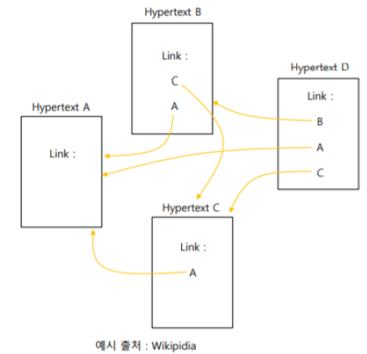
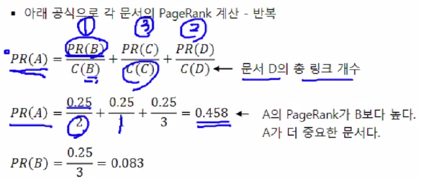
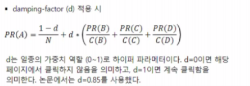
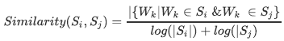
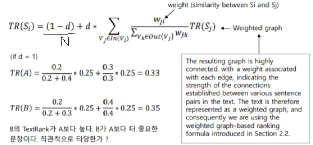
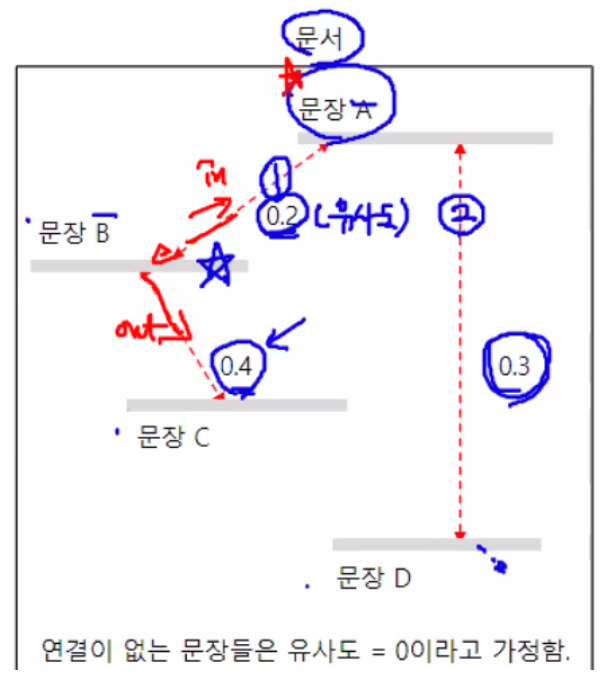

#  고급 NLP

## TF-IDF

1. vocabulary를 만든다.
2. 문서 별로 vocabulary가 얼마나 있는지를 만들어주는 Term-document matrix(TDM)를 생성한다. 역은 Document-term matrix(DTM)이라고 한다.
3. 문서 자체가 긴 경우 단어의 빈도 수 자체가 많을 것이므로, 문서 길이로 표준화한다. 이를 Term Frequency(TF)라 한다.
4. Document Frequency(DF)는 단순히 단어의 빈도를 더한 것이 아니다. 특정 단어가 나타난 ''문서''의 수이다.
5. DF가 크다는 것은 여러 문서에 나타나는 general한 단어라는 의미를 가진다. 즉, 중요도가 떨어지게 된다.
6. 또한 Term Frequency와는 반비례함을 알 수 있다.
7. IDF는 Inverse DF로, log(3/DF)로 계산된다. 단어의 중요도 자체는 TF, IDF와 비례하므로 TF*IDF에 비례한다.
8. 해당 값들을 계산하여 문서를 벡터화시킨다.
9. 해당 벡터를 이용하여 내적 / 거리 / cos similarity를 계산할 수 있다.


## 주제 식별(Topic modeling)

> Topic modeling은 Clustering 기법으로 대표적인 알고리즘으로는 LDA가 있다.

### LSA(Latent Semantic Analysis) 잠재 의미 분석
#### SVD

> 특이값 분해(SVD)를 기본으로 하는 아이디어이다.

```python
import numpy as np
from sklearn.feature_extraction.text import TfidfVectorizer 
```

필요한 모듈들을 불러온다.

```python
statements = [
            'ruled india',
            'Chalukyas ruled Badami',
            'So many kingdoms ruled India',
            'Lalbagh is a botanical garden in India'
        ]

tf_vector = TfidfVectorizer(max_features = 8) # 최대 단어 개수가 8개이다.
tfidf = tf_vector.fit_transform(statements) # toarray를 사용하면 배열 형태로 사용 가능하다.
tfidf.toarray()
```

```
array([[0.        , 0.        , 0.70710678, 0.        , 0.        ,
        0.        , 0.70710678, 0.        ],
       [0.64450299, 0.64450299, 0.        , 0.        , 0.        ,
        0.        , 0.41137791, 0.        ],
       [0.        , 0.        , 0.32679768, 0.51199172, 0.        ,
        0.51199172, 0.32679768, 0.51199172],
       [0.        , 0.        , 0.53802897, 0.        , 0.84292635,
        0.        , 0.        , 0.        ]])
```

위는 문장들을 TF-IDF 형태로 변환한 것이다. 변환된 행렬을 SVD로 분해해보자.


```python
U, S, VT = np.linalg.svd(tfidf.toarray(), full_matrices = True)
```

위 실행은 U, S, VT를 각각 반환해주는데, U는 직교 행렬, S는 대각 행렬, VT는 transposed 직교 행렬이다. 이 때 LSA에서는 의미있는 feature만 사용하기 위하여 truncate방법을 사용한다. 대각 행렬에서 유의미한 성분만 남기고 모두 자른 뒤 양옆 행렬들의 크기를 대각행렬에 맞춘다. 이는 차원 축소된 형태이며 이를 Latent features라 부른다.


#### News data LSA

> 문서들을 주제별로 클러스터링해보자.

```python
from sklearn.feature_extraction.text import TfidfVectorizer
from sklearn.decomposition import TruncatedSVD
```

> TF-IDF형태로 바꾼다.

```python
tf_vector = TfidfVectorizer(max_features = 500)
tfidf = tf_vector.fit_transform(news2)
vocab = tf_vector.get_feature_names()
```

> svd를 학습시킨다.

```python
svd = TruncatedSVD(n_components = len(newsData.target_names), n_iter=1000)
svd.fit(tfidf)

U = svd.fit_transform(tfidf) / svd.singular_values_ # U행렬. 보통 I행렬이지만 truncated SVD를 썼기 때문에 정확한 형태로 나오지는 않는다.
VT = svd.components_ # VT행렬
S = np.diag(svd.singular_values_) # S 행렬
```

```
In [264]: pd.DataFrame(U)
Out[264]: 
             0         1         2   ...        17        18        19
0      0.008341 -0.010915 -0.003287  ...  0.019365 -0.014455  0.007904
1      0.008759 -0.004104 -0.005163  ... -0.021036 -0.008024 -0.008950
2      0.014119 -0.007628  0.016637  ...  0.021013 -0.016137  0.019712
3      0.010351 -0.004610 -0.012785  ... -0.002014 -0.014875  0.009894
4      0.008519 -0.001631 -0.002457  ...  0.008119  0.003916  0.001131
...         ...       ...       ...  ...       ...       ...       ...
11309  0.002137 -0.004316  0.002279  ...  0.031526 -0.022277  0.018622
11310 -0.000000 -0.000000 -0.000000  ... -0.000000 -0.000000  0.000000
11311  0.005247 -0.003111  0.001752  ...  0.001325 -0.003303 -0.001316
11312  0.005806  0.011614 -0.012956  ... -0.004408  0.027371 -0.027153
11313  0.015866 -0.009819 -0.011595  ...  0.006581 -0.005493  0.013990

[11314 rows x 20 columns]
```

```
In [265]: pd.DataFrame(VT)
Out[265]: 
         0         1         2    ...       497       498       499
0   0.045571  0.026463  0.053648  ...  0.044716  0.073847  0.071774
1   0.013572  0.036633 -0.029141  ... -0.024945 -0.068839 -0.058020
2  -0.012950 -0.028216 -0.022121  ... -0.006873 -0.093267 -0.037503
3  -0.017377 -0.029315 -0.000805  ... -0.008597  0.301130  0.075342
4   0.019601  0.017515 -0.000846  ... -0.034339  0.014069 -0.016211
5  -0.001856  0.021939 -0.014306  ... -0.009471 -0.010374  0.011211
6   0.007450 -0.018748  0.002415  ...  0.019098 -0.085129 -0.038175
7  -0.009381 -0.003693 -0.003191  ... -0.019378 -0.065425 -0.006800
8  -0.021377 -0.026778 -0.004747  ...  0.026341  0.007366 -0.064730
9  -0.002390 -0.015197  0.004431  ... -0.006075 -0.111539 -0.013238
10  0.015748 -0.010825 -0.015295  ... -0.026767  0.049910  0.016336
11  0.005704  0.017645  0.008853  ...  0.025990 -0.004363 -0.034698
12  0.005539 -0.015197  0.007322  ...  0.032771 -0.044487 -0.028374
13  0.012280  0.028077 -0.024695  ... -0.036391  0.072430 -0.010974
14 -0.013889  0.011700 -0.002946  ... -0.011762  0.092376  0.030758
15 -0.009344 -0.026163  0.000443  ... -0.016433  0.182474  0.105397
16  0.002059 -0.007409 -0.017954  ... -0.013353 -0.108632 -0.039787
17 -0.012828 -0.009903 -0.030443  ...  0.000019 -0.010294  0.039407
18 -0.020535 -0.010733 -0.003074  ...  0.010791 -0.002880 -0.003635
19  0.005887  0.015333 -0.010744  ...  0.022135  0.202575  0.004004

[20 rows x 500 columns]
```

```
In [266]: pd.DataFrame(S)
Out[266]: 
           0          1         2   ...        17        18        19
0   21.541552   0.000000  0.000000  ...  0.000000  0.000000  0.000000
1    0.000000  11.428398  0.000000  ...  0.000000  0.000000  0.000000
2    0.000000   0.000000  9.423145  ...  0.000000  0.000000  0.000000
3    0.000000   0.000000  0.000000  ...  0.000000  0.000000  0.000000
4    0.000000   0.000000  0.000000  ...  0.000000  0.000000  0.000000
5    0.000000   0.000000  0.000000  ...  0.000000  0.000000  0.000000
6    0.000000   0.000000  0.000000  ...  0.000000  0.000000  0.000000
7    0.000000   0.000000  0.000000  ...  0.000000  0.000000  0.000000
8    0.000000   0.000000  0.000000  ...  0.000000  0.000000  0.000000
9    0.000000   0.000000  0.000000  ...  0.000000  0.000000  0.000000
10   0.000000   0.000000  0.000000  ...  0.000000  0.000000  0.000000
11   0.000000   0.000000  0.000000  ...  0.000000  0.000000  0.000000
12   0.000000   0.000000  0.000000  ...  0.000000  0.000000  0.000000
13   0.000000   0.000000  0.000000  ...  0.000000  0.000000  0.000000
14   0.000000   0.000000  0.000000  ...  0.000000  0.000000  0.000000
15   0.000000   0.000000  0.000000  ...  0.000000  0.000000  0.000000
16   0.000000   0.000000  0.000000  ...  0.000000  0.000000  0.000000
17   0.000000   0.000000  0.000000  ...  6.989441  0.000000  0.000000
18   0.000000   0.000000  0.000000  ...  0.000000  6.930628  0.000000
19   0.000000   0.000000  0.000000  ...  0.000000  0.000000  6.885065

[20 rows x 20 columns]
```

> U, VT, S가 위와 같이 나옴을 확인할 수 있다. 이 때 U*S행렬의 열들은 Topic을 의미하며, 행들은 문서들을 의미한다. 또한 VT행렬의 열들은 Term들을 의미하며, 행들은 Topic들을 의미한다. 각각의 원소들은 단어의 중요도를 나타낸다.


```python
for i in range(10):
    print('문서-{:d} : topic = {:d}'.format(i, np.argmax(U[i:(i+1), :][0])))
    
for i in range(len(VT)):
    idx = np.flipud(VT[i].argsort())[:10]
    print('토픽-{:2d} : '.format(i+1), end='')
    for n in idx:
        print('{:s} '.format(vocab[n]), end='')
    print()
    
def checkTopic(x, y):
    print("문서 %d의 topic = %s" % (x, newsData.target_names[newsData.target[x]]))
    print("문서 %d의 topic = %s" % (y, newsData.target_names[newsData.target[y]]))

checkTopic(1, 6)
checkTopic(0, 2)
```

```
문서-0 : topic = 17
문서-1 : topic = 0
문서-2 : topic = 17
문서-3 : topic = 5
문서-4 : topic = 3
문서-5 : topic = 8
문서-6 : topic = 0
문서-7 : topic = 6
문서-8 : topic = 7
문서-9 : topic = 12
토픽- 1 : would like know people think good also could time well 
토픽- 2 : thanks windows please anyone mail card know advance drive file 
토픽- 3 : would thanks anyone know like please could mail someone advance 
토픽- 4 : game team year games good last season players play hockey 
토픽- 5 : would like drive system windows card scsi disk team problem 
토픽- 6 : drive please scsi hard mail sale would email drives people 
토픽- 7 : drive know like anyone scsi drives hard something card think 
토픽- 8 : like please sale mail email offer something send list interested 
토픽- 9 : think windows people please card jesus thanks believe bible mail 
토픽-10 : good card think sale price bike also much looking offer 
토픽-11 : card people video know sale monitor government drivers price offer 
토픽-12 : think chip system could encryption clipper need government space much 
토픽-13 : could thanks right card problem much bike well someone advance 
토픽-14 : good people windows file government files thanks drive would year 
토픽-15 : anyone thanks like good also people space card could system 
토픽-16 : space year thanks problem nasa much bike also time think 
토픽-17 : problem thanks system game need window jesus time first using 
토픽-18 : anyone right israel think sale window problem israeli government back 
토픽-19 : problem people please anyone could system email problems good time 
토픽-20 : also year good know window problem please israel last using 
문서 1의 topic = alt.atheism
문서 6의 topic = comp.sys.mac.hardware
문서 0의 topic = talk.politics.mideast
문서 2의 topic = talk.politics.mideast
```

> 최종 결과물은 위와 같다.


###### 부록: 차원 축소와 Topic modeling

- PCA: Eigenvalue Decomposition(고유값 분해) 사용
- SVD: Singular Value Decomposition(특이값 분해) 사용

> 위 모델들은 차원 축소를 주 목적으로 사용하지만, Topic modeling에도 사용한다. 특히 SVD는 LSA에 많이 사용한다.

- LSA: SVD원리 사용
- LDA: 결합확률분포 취급. 근사적인 sampling 방법을 사용하는데, Gibbs' sampling을 사용한다.


### LDA(Latent Dirichlet Allocation)

> 토픽을 먼저 추정한 후 문서 별로 토픽이 얼마나 분포되어있는지, 토픽 별로 문서들이 얼마나 분포되어 있는지 베이지안 방법에 따라 사전분포를 결정한 후 디리클레 분포와 Multivariate 분포의 수학적인 사후 확률 공식을 이용하여 토픽을 모델링하는 방법. 

#### 문서가 생성되는 원리

사전 분포 Dir(alpha), 실제 확률분포 Multinomial을 곱하여 사후확률 분포 Dir(alpha + X)를 추정한다. 이 때 Multinomial 분포를 결정함에 있어 Gibbs' sampling을 사용한다. Multinomial 분포의 예시로 토픽 별 문서의 분포 / 문서 별 토픽의 분포 등을 사용할 수 있다. 사후확률분포가 결정되면 가장 높은 확률을 추론할 수 있으므로 문서를 생성해낼 수 있다.

#### scikit-learn의 LDA 사용하기

``` python
from sklearn.decomposition import LatentDirichletAllocation as LDA
```

> 모듈 불러오기

```python
model = LDA(n_components = len(newsData.target_names), 
            learning_method='online', 
            evaluate_every=5, 
            max_iter=1000, 
            verbose=1)

doc_topic = model.fit_transform(tfidf)
```

```
In [296]: tfidf.toarray().shape
Out[296]: (11314, 500) # (문서 개수, 단어 개수)
```

> TF-IDF로 변환된 학습 겸 입력 데이터의 shape

```python
doc_topic = model.fit_transform(tfidf)

In [297]: doc_topic.shape
Out[297]: (11314, 20) # (문서 개수, 토픽 개수)
```

TF-IDF데이터로 LDA를 학습시킨 모델에 TF-IDF 데이터를 넣어 도출해낸 결과물의 shape. model의 파라미터에 n_components를 target의 개수(Topic의 개수)와 같게 하였기 때문에 결과의 열 개수가 20개가 되었다.

#### gensim의 LDA 사용하기

```python
from gensim import corpora
from gensim.models.ldamodel import LdaModel as LDA
```

> 필요한 모듈들 불러오기

```python
model = LDA(news_bow, 
            num_topics = len(newsData.target_names), 
            id2word=vocab)
```

```
문서-0 : topic = 13
문서-1 : topic = 13
문서-2 : topic = 13
문서-3 : topic = 3
문서-4 : topic = 9
문서-5 : topic = 10
문서-6 : topic = 6
문서-7 : topic = 1
문서-8 : topic = 0
문서-9 : topic = 4
```

```
토픽- 1 : henrik insurance would sabbath maine jesus unto said people room 
토픽- 2 : would people know think like right time things good even 
토픽- 3 : space also system nasa data anonymous number available contest pain 
토픽- 4 : government encryption would security public chip system clipper keys technology 
토픽- 5 : bike null know much widget would like engine time problem 
토픽- 6 : ground wire pitt gordon neutral surrender banks wiring skepticism soon 
토픽- 7 : file output drive disk system problem data program used using 
토픽- 8 : church greek would also catholic greece time pope must well 
토픽- 9 : windows also would like version thanks know anyone available need 
토픽-10 : game team year games play season last first would period 
토픽-11 : would think people jesus believe like know said could time 
토픽-12 : list entries entry would file send program request mail news 
토픽-13 : scsi simms vram simm burst inflammation hawks chip quadra wide 
토픽-14 : people armenian armenians said would jews israel many turkish israeli 
토픽-15 : sleeve rockefeller picture moon lunar orbit rockets intentional rocket erzurum 
토픽-16 : health patients compass disease medical diseases april hicnet would dept 
토픽-17 : would like time know well right people used back years 
토픽-18 : window display color server available thanks information would program data 
토픽-19 : navy naval astros recognition solaris israel aged division volvo canadiens 
토픽-20 : motif export contrib program university information xlib allocation part classes 
```

```
문서 2의 topic = talk.politics.mideast
문서 5의 topic = soc.religion.christian
문서 7의 topic = talk.politics.mideast
문서 9의 topic = sci.electronics
```

> 최종 결과물은 위와 같다.


## PageRank 알고리즘




4개의 문서 A, B, C, D가 있다. 각 링크 연결 상태가 노란 선으로 표시되어 있다. A는 3개 페이지로부터, B는 1개 페이지로부터, C는 2개 페이지로부터, D는 0개 페이지로부터 링크가 걸려 있다. A가 가장 중요해 보인다.


이 아이디어를 어떻게 수치화하여 나타낼 수 있을까?


1. 각 페이지의 PageRank 초기화

   문서의 개수를 N이라 할 때, 각 페이지 랭크를 1/N으로 초기화한다.

   

2. 각 페이지의 PageRank 계산 및 반복

   각 문서마다 다음과 같은 방식으로 PageRank를 계산한다.

   

   

   A 문서를 예로 들어 확인하자. A로 유입되는 링크가 있는 문서는 B, C, D이다. B, C, D 각각의 총 링크 개수를 분모에, B, C, D 각각의 PageRank를 분자에 놓고 더한 값으로 PageRank값을 업데이트한다.


3. damping-factor 적용

   

   - d가 0이면 해당 페이지에서 클릭하지 않음을 의미한다. 가중치를 0으로 설정한다. 예컨대 링크가 걸려 있어도 링크에 관심이 없으면 클릭을 하지 않는다. 그렇게 클릭하지 않아 d가 0이라면 1/N만 남는다.
   - d=1이면 계속해서 클릭한다.

   이러한 클릭의 빈도 등을 조절해주는 역할을 하는 파라미터가 d이다. 논문의 저자는 0.85를 적용했다.

   > PageRank 알고리즘에서는 중요한 문서로부터 얼마나 많은 링크가 걸려 있는지가 중요하다. 연결의 질을 따진다.


## TextRank 알고리즘

Google의 PageRank 알고리즘을 차용해서 만든 문서 요약 알고리즘이다. 하나의 문서 안에 여러 문장들이 있을 때, 문장들 간의 연계 및 유사도가 있을 것이다. 중요한 문장, 유사한 문장일수록 자주 등장할 것이라는 아이디어를 기반으로 한다.


1. 각 문장의 TextRank 초기화

   PageRank와 동일하게, 문장 개수의 역수로 초기화한다.

2.  문장 간 유사도 측정



​	i번째 문장과 j번째 문장 간 유사도 계산 과정을 반복한다.

	- 분모: 각 문장 단어 개수의 절댓값에 로그를 취한 것을 더한 값.
	- 분자: 두 문장 모두에 등장하는 단어의 개수의 절댓값을 취한 값.

3. TextRank 계산 및 반복

   

   - 위 공식으로 각 문장의 TextRank 계산 및 반복
   - in: 관련 있는 문장
   - out: 관련 있는 문장과 관련이 있는 또 다른 문장

   

   TR(A) 를 계산하는 방법을 보는 것이 더 잘 이해된다.

   

   그림 상으로 보면 문장 A는 B, D와 관련 있다. 따라서 각 문장과의 유사도를 분자에 놓는다. B 입장에서
   는 A와도 관련 있고, C와도 관련 있다. 따라서 A와 B, B와 C의 유사도를 더한 것을 B 부분의 분자에 놓는
   다.

   

   문장 A의 경우 0.2, 0.3 문장이 주목하고, B의 경우 0.2, 0.4 문장이 주목한다. 직관적으로 B가 A보다 더
   중요한 것처람 보이는데, 실제로 그렇다.

   

   위와 같은 방법에 의해 모든 문장에 대해 TR 지수를 계산한 후, 가장 높은 것들을 뽑아 내면 그 문서를
   대표하는 문장이라고 본다.


#### gensim 라이브러리로 간단히 구현

```python
from gensim.summarization.summarizer import summarize

text= \
    """Rice Pudding - Poem by Alan Alexander Milne
    What is the matter  with Mary Jane?
    She's crying with all her might and main,
    And she won't eat her dinner - rice pudding again -
    What is the matter with Mary Jane?
    What is the matter with Mary Jane?
    I've promised her dolls and a daisy-chain,
    And a book about animals - all in vain -
    What is the matter with Mary Jane?
    What is the matter with Mary Jane?
    She's perfectly well, and she hasn't a pain;
    But, look at her, now she's beginning again! -
    What is the matter with Mary Jane?
    What is the matter with Mary Jane?
    I've promise her sweets and a ride in the train,
    And I've begged her to stop for a bit and explain -
    What is the matter with Mary Jane?
    What is the matter with Mary Jane?
    She's perfectly well and she hasn't a pain,
    And it's lovely rice pudding for dinner again!
    What is the matter with Mary Jane?
    """

summary= summarize(text, ratio= 0.1)

print(summarize(text))
```

```
And she won't eat her dinner - rice pudding again -
I've promised her dolls and a daisy-chain,
I've promise her sweets and a ride in the train,
And it's lovely rice pudding for dinner again!
```

> summarize함수는 TextRank 알고리즘을 기반으로 하고 있으며, 위는 그 알고리즘으로 중요한 문장들을 추출한 예시이다.