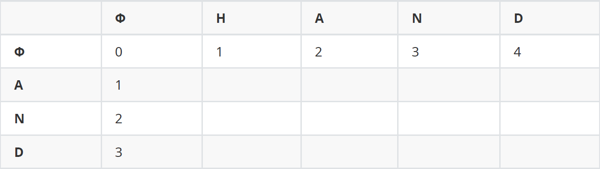

# 편집 거리(Edit Distance) Algorithm

편집 거리(Levenshtein Distance)란 두 문서간의 유사도를 판단하는 데 사용되는 알고리즘이다. 이 때 거리는 형태적인 거리일 뿐 의미적인 거리는 아니다.


## 알고리즘

한 문자열을 다른 문자열로 만들기 위해 다음과 같은 편집 연산을 사용할 수 있다.

- 삭제
- 삽입
- 대체(치환)

한 문자열을 다른 문자열로 만들기 위해, 문자열의 철자를 하나씩 비교하여 얼마나 많은 편집 연산이 필요한지 판단한다. 최소한의 편집 연산의 수를 편집 cost로 본다.

1. 처음 비교 대상은 공집합이다.
   - 공집합과 공집합은 같은 문자열이기 때문에 바꿀 것이 없다.
   - 공집합에서 다음 문자열로 가기 위해 하나씩 추가해야 하기 때문에, 1행과 1열의 cost는 0에서 1, 2, 3과 같이 1씩 증가한다.




2. (m, n) 행렬의 cost를 계산하기 위해, 이전까지의 문자열과 누적하여 비교한다. 다음의 예시 몇 가지를 살펴본다.
   - (1, 1): A를 H로 만들기 위해 대체한다.
   - (2, 2): AN을 HA로 만들기 위해 A를 H로 대체하고, N을 A로 대체한다. 2번의 연산이 필요하다.
   - (2, 3): AN을 HAN으로 만들기 위해 H를 추가한다. 1번의 연산이 필요하다.
   - (3, 3): AND를 HAND로 만들기 위해 H를 추가한다. 1번의 연산이 필요하다.


이렇게 채운 표의 맨 마지막 요소가 한 문자열을 다른 문자열로 바꾸기 위해 필요한 연산의 최소 수가 된다.


## 코드 구현

```python
from nltk.metrics.distance import edit_distance
def my_edit_distance(str1, str2):
    m = len(str1) + 1
    n = len(str2) + 1
    table = {}

    for i in range(m):
        table[i, 0] = i
    for j in range(n):
        table[0, j] = j
        
    for i in range(1, m):
        for j in range(1, n):
            cost = 0 if str1[i-1] == str2[j-1] else 1 
            # 같으면 0(더할 연산이 없음),1(한 번 연산 더 해야 함.)
            table[i, j] = min(table[i, j-1] + 1,
                              table[i-1, j] + 1,
                              table[i-1, j-1] + cost)
    return table[i, j]

print(my_edit_distance('HAND', 'AND'))
print(edit_distance('HAND', 'AND'))
```

```
1
1
```

