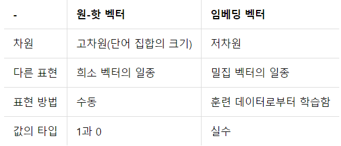

# Word Embedding

## 개요

기존의 빈도에 기반한 벡터화 방식(TF-IDF, BOW, Doc2BOW, cooccurence Matrix)들은 단어에 의미를 부여하지 못하고 형식적인 단어 임베딩만 가능하였다. 따라서 확률적인 통계 기반의 이론들로 설명되었다. 그러나 Word Embedding 방식은 단어의 의미를 고려하여 벡터화하는 방법을 설명한다. 또한 이는 학습 기반으로 임베딩된다.

기본적으로 Word Embedding은 Supervised learning이며, 현재 NLP분야의 원리는 단어 기반의 NLP(POS-tag / stemmer 등)가 주류이다. 현재는 Character-based NLP가 Embedding방식의 새로운 방법론으로 의논되고 있다.

> Word Embedding Layer의 구성은 아래와 같다.

- 입력층
  - 문장이 I love you very much라고 한다면, 단어 기준으로 5개로 구분되므로 입력층을 5개로 구성한다.
- 은닉층
  - 총 vocabulary size로 one-hot 벡터화한다.
  - 예를 들어 500개의 vocabulary size를 가진다면, 입력층의 W matrix는 5X500이 된다.
  - one-hot vector로 바꿀 때 to_categorical 함수를 이용하며, one-hot vector로 바꾼다는 의미는 모든 단어의 의미를 초기화하여 벡터화시킨다는 뜻이다. 또한 padding개념을 사용하는데, 예를들어 앞부분에 padding하는 경우 없는 단어이지만 하나의 단어에 하나의 index를 할당한다. 그리고 embedding과정에서 해당 단어도 하나의 단어로 취급한다.
- 출력층
  - 64개의 출력층(단어를 64byte의 수치 벡터로 표현하기 위해)을 가졌다고 한다면, 학습에 의해 나오는 결과물의 크기는 (5 X 500) X (500 X 64) = (5 X 64)일 것이다. 이 크기를 embedding size라고 부르며, 경험적으로 결정한다.
  - 위 결과물의 행들은 한 단어의 의미를 지닌 벡터로 Embedding된다. 이는 유사도 측정이 가능해졌음을 의미하기도 한다.




> Embedding Layer에서 결정할 Hyperparameter들은 총 vocabulary size(hidden layer)의 개수, Embedding size(Output layer)의 개수이다.

#### 단점

- 해당 Embedding은 형태적으로는 같으나 의미가 다른 단어들을 같은 Embedding vector로 취급하기 때문에 구분하지 못한다.
- Corpus가 수정될 때 마다 계속 새로 학습해야 한다.
- 없는 단어(Out of vocabulary)를 학습하지 못한다.


## Conv1D층으로 구현한 Embedded IMDB

```python
from tensorflow.keras.preprocessing import sequence
from tensorflow.keras.models import Sequential
from tensorflow.keras.layers import Dense, Dropout, Activation
from tensorflow.keras.layers import Embedding
from tensorflow.keras.layers import Conv1D, GlobalMaxPooling1D
from tensorflow.keras.datasets import imdb
from sklearn.metrics import accuracy_score
import matplotlib.pyplot as plt
import numpy as np
```

> 필요한 모듈들 불러오기


```python
(x_train, y_train), (x_test, y_test) = imdb.load_data(num_words=max_features)

x_train = sequence.pad_sequences(x_train, maxlen=max_length)
x_test = sequence.pad_sequences(x_test, maxlen=max_length)
```

> IMDB dataset을 불러와 train dataset과 test dataset으로 나눈 후 padding을 실행한다. padding 전후의 dataset예시는 아래와 같다.

```
np.array(x_train[0])
Out[21]: 
array([   1,   14,   22,   16,   43,  530,  973, 1622, 1385,   65,  458,
       4468,   66, 3941,    4,  173,   36,  256,    5,   25,  100,   43,
        838,  112,   50,  670,    2,    9,   35,  480,  284,    5,  150,
          4,  172,  112,  167,    2,  336,  385,   39,    4,  172, 4536,
       1111,   17,  546,   38,   13,  447,    4,  192,   50,   16,    6,
        147, 2025,   19,   14,   22,    4, 1920, 4613,  469,    4,   22,
         71,   87,   12,   16,   43,  530,   38,   76,   15,   13, 1247,
          4,   22,   17,  515,   17,   12,   16,  626,   18,    2,    5,
         62,  386,   12,    8,  316,    8,  106,    5,    4, 2223, 5244,
         16,  480,   66, 3785,   33,    4,  130,   12,   16,   38,  619,
          5,   25,  124,   51,   36,  135,   48,   25, 1415,   33,    6,
         22,   12,  215,   28,   77,   52,    5,   14,  407,   16,   82,
          2,    8,    4,  107,  117, 5952,   15,  256,    4,    2,    7,
       3766,    5,  723,   36,   71,   43,  530,  476,   26,  400,  317,
         46,    7,    4,    2, 1029,   13,  104,   88,    4,  381,   15,
        297,   98,   32, 2071,   56,   26,  141,    6,  194,    2,   18,
          4,  226,   22,   21,  134,  476,   26,  480,    5,  144,   30,
       5535,   18,   51,   36,   28,  224,   92,   25,  104,    4,  226,
         65,   16,   38, 1334,   88,   12,   16,  283,    5,   16, 4472,
        113,  103,   32,   15,   16, 5345,   19,  178,   32])
```

```
In [24]: x_train[0]
Out[24]: 
array([   0,    0,    0,    0,    0,    0,    0,    0,    0,    0,    0,
          0,    0,    0,    0,    0,    0,    0,    0,    0,    0,    0,
          0,    0,    0,    0,    0,    0,    0,    0,    0,    0,    0,
          0,    0,    0,    0,    0,    0,    0,    0,    0,    0,    0,
          0,    0,    0,    0,    0,    0,    0,    0,    0,    0,    0,
          0,    0,    0,    0,    0,    0,    0,    0,    0,    0,    0,
          0,    0,    0,    0,    0,    0,    0,    0,    0,    0,    0,
          0,    0,    0,    0,    0,    0,    0,    0,    0,    0,    0,
          0,    0,    0,    0,    0,    0,    0,    0,    0,    0,    0,
          0,    0,    0,    0,    0,    0,    0,    0,    0,    0,    0,
          0,    0,    0,    0,    0,    0,    0,    0,    0,    0,    0,
          0,    0,    0,    0,    0,    0,    0,    0,    0,    0,    0,
          0,    0,    0,    0,    0,    0,    0,    0,    0,    0,    0,
          0,    0,    0,    0,    0,    0,    0,    0,    0,    0,    0,
          0,    0,    0,    0,    0,    0,    0,    0,    0,    0,    0,
          0,    0,    0,    0,    0,    0,    0,    0,    0,    0,    0,
          0,    0,    0,    0,    0,    0,    1,   14,   22,   16,   43,
        530,  973, 1622, 1385,   65,  458, 4468,   66, 3941,    4,  173,
         36,  256,    5,   25,  100,   43,  838,  112,   50,  670,    2,
          9,   35,  480,  284,    5,  150,    4,  172,  112,  167,    2,
        336,  385,   39,    4,  172, 4536, 1111,   17,  546,   38,   13,
        447,    4,  192,   50,   16,    6,  147, 2025,   19,   14,   22,
          4, 1920, 4613,  469,    4,   22,   71,   87,   12,   16,   43,
        530,   38,   76,   15,   13, 1247,    4,   22,   17,  515,   17,
         12,   16,  626,   18,    2,    5,   62,  386,   12,    8,  316,
          8,  106,    5,    4, 2223, 5244,   16,  480,   66, 3785,   33,
          4,  130,   12,   16,   38,  619,    5,   25,  124,   51,   36,
        135,   48,   25, 1415,   33,    6,   22,   12,  215,   28,   77,
         52,    5,   14,  407,   16,   82,    2,    8,    4,  107,  117,
       5952,   15,  256,    4,    2,    7, 3766,    5,  723,   36,   71,
         43,  530,  476,   26,  400,  317,   46,    7,    4,    2, 1029,
         13,  104,   88,    4,  381,   15,  297,   98,   32, 2071,   56,
         26,  141,    6,  194,    2,   18,    4,  226,   22,   21,  134,
        476,   26,  480,    5,  144,   30, 5535,   18,   51,   36,   28,
        224,   92,   25,  104,    4,  226,   65,   16,   38, 1334,   88,
         12,   16,  283,    5,   16, 4472,  113,  103,   32,   15,   16,
       5345,   19,  178,   32])
```

0으로 padding된 항이 있음을 알 수 있으며, shape은 (25000,)에서 (25000, 400)으로 맞추어졌다.


> 모델

```python
max_features = 6000
max_length = 400

batch_size = 32
embedding_dims = 60
num_kernels = 260        # convolution filter 개수
kernel_size = 3          # convolution filter size
hidden_dims = 300
epochs = 10

model = Sequential()
model.add(Embedding(max_features, embedding_dims, input_length=max_length))
model.add(Dropout(0.2))
model.add(Conv1D(num_kernels, kernel_size, padding='valid', activation='relu', strides=1))
model.add(GlobalMaxPooling1D())
model.add(Dense(hidden_dims))
model.add(Dropout(0.5))
model.add(Activation('relu'))
model.add(Dense(1))
model.add(Activation('sigmoid'))
model.compile(loss='binary_crossentropy', optimizer='adam')
print(model.summary())

hist = model.fit(x_train, y_train, 
                 batch_size=batch_size, 
                 epochs=epochs,
                 validation_data = (x_test, y_test))
```

```
Model: "sequential_1"
_________________________________________________________________
Layer (type)                 Output Shape              Param #   
=================================================================
embedding_1 (Embedding)      (None, 400, 60)           360000    
_________________________________________________________________
dropout_2 (Dropout)          (None, 400, 60)           0         
_________________________________________________________________
conv1d_1 (Conv1D)            (None, 398, 260)          47060     
_________________________________________________________________
global_max_pooling1d_1 (Glob (None, 260)               0         
_________________________________________________________________
dense_2 (Dense)              (None, 300)               78300     
_________________________________________________________________
dropout_3 (Dropout)          (None, 300)               0         
_________________________________________________________________
activation_2 (Activation)    (None, 300)               0         
_________________________________________________________________
dense_3 (Dense)              (None, 1)                 301       
_________________________________________________________________
activation_3 (Activation)    (None, 1)                 0         
=================================================================
Total params: 485,661
Trainable params: 485,661
Non-trainable params: 0
_________________________________________________________________
```

> 학습의 loss history는 아래와 같다.


## LSTM층으로 구현한 Embedded IMDB

#### Input함수의 형태에 따른 차이점 및 장단점

```python
x= Input(batch_size= (None, t= 10, f= 8))
x= Input(batch_size= (None, None, f= 8))
```

위는 t의 개수에 맞춰 padding이 필요하며, 아래는 굳이 padding해주지 않아도 된다. 그러나 위는 batch_size를 지정할 수 있어 학습 속도가 빠르지만, 아래는 batch_size를 지정할 수 없어 시간이 오래 걸린다.

```python
xInput = Input(batch_shape=(None, max_length))
xEmbed = Embedding(max_features, 60)(xInput)
xLstm = Bidirectional(LSTM(64))(xEmbed)
xOutput = Dense(1, activation='sigmoid')(xLstm)
model = Model(xInput, xOutput)
model.compile(loss='binary_crossentropy', optimizer='adam')

hist = model.fit(x_train, y_train, 
                 batch_size=32, 
                 epochs=10,
                 validation_data = (x_test, y_test))
```

```
_________________________________________________________________
Layer (type)                 Output Shape              Param #   
=================================================================
input_1 (InputLayer)         [(None, 400)]             0         
_________________________________________________________________
embedding_2 (Embedding)      (None, 400, 60)           360000    
_________________________________________________________________
bidirectional (Bidirectional (None, 128)               64000     
_________________________________________________________________
dense_4 (Dense)              (None, 1)                 129       
=================================================================
Total params: 424,129
Trainable params: 424,129
Non-trainable params: 0
_________________________________________________________________
```

> 학습의 loss history는 아래와 같다.


