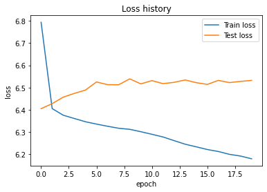
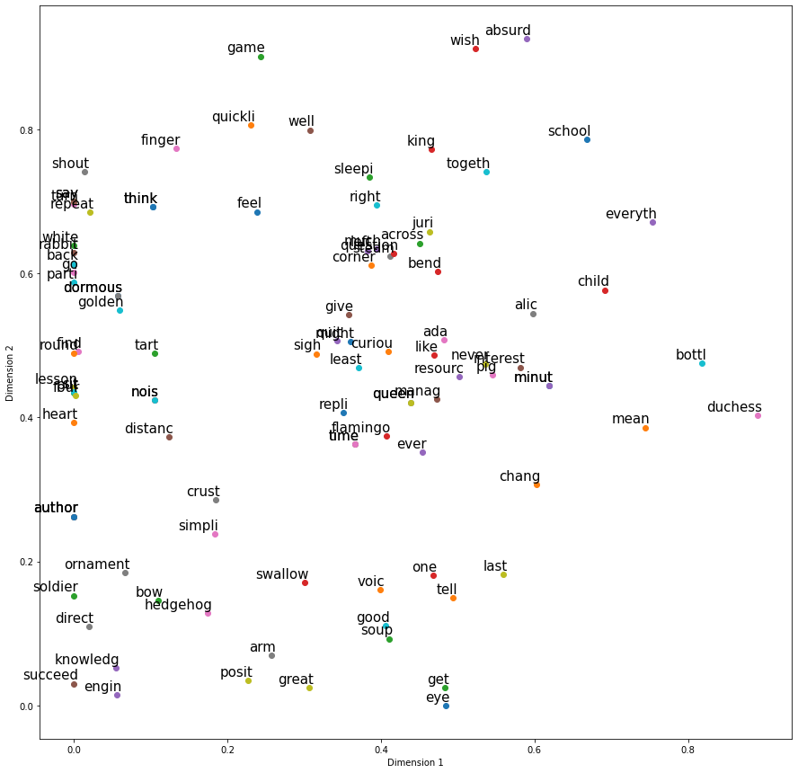

# Word2Vec

##  개요

문서를 수치화함에 있어 Bag of word(BOW)나 TF-IDF를 사용했고, 의미를 부여하기 위해 Word Embedding을 사용하였다. Word Embedding은 classification등의 특적 목적을 달성하기 위해 그때마다 학습하는 방식이어서 사후적으로 결정되고 특정 목적에 한정된다. 

그러나 Word2Vec은 방대한 양의 코퍼스를 학습하여 단어들이 어떤 관계를 갖도록 벡터화하는 기술이다. 특정 목적에 맞게 벡터화하는 것이 아닌, 목적에 상관없이 범용적으로 사용할 수 있도록 벡터화시킨다. Word2Vec은 다음의 성질을 갖는다.

- 사후에 학습되는 것이 아닌 사전에 학습하여 단어들을 수치 벡터로 표현한다.
- 단어의 주변 단어들(Context)을 참조하여 해당 단어를 수치화한다. 주변 단어들을 참조하므로 distributed representation이라 한다.

Word2Vec의 종류에는 CBOW와 Skip-Gram 두가지가 있다.


### Continuous Bag-of-Words(CBOW) 소개

CBOW는 주변 단어들을 입력받아 해당 단어가 나오도록 학습한다. 


이 때 우리가 얻고자 하는 단어 hurt의 Word2Vec vector는 위 네트워크의 Hidden layer에 해당한다. 주변 문장들을 모두 넣어줘야 하나의 단어에 대한 Word2Vec이 생성된다.


### Skip-Gram 소개

Skip-Gram은 해당 단어를 입력 받아 주변 단어가 나오도록 학습한다. 단어 하나만으로 Word2Vec Layer를 출력할 수 있으므로 편하다는 장점이 있다.


## Skip-Gram 예시

> 소설 Alice in Wonderland를 읽어온다.

```python
lines = []
fin = open("./dataset/alice_in_wonderland.txt", "r")
for line in fin:
    if len(line) == 0:
        continue
    lines.append(preprocessing(line))
fin.close()
```


> 단어들이 사용된 횟수를 카운트한다. 딕셔너리 형태의 결과물이 출력된다.

```python
counter = collections.Counter()
```


> vocabulary를 생성한다.

```python
for line in lines:
    for word in nltk.word_tokenize(line):
        counter[word.lower()] += 1
```

한 개 라인마다 반복, 라인의 단어들을 tokenize하여 센 뒤 사용 횟수가 조회되면 1회씩 더한다.


> 사전을 구축한다.

```python
word2idx = {w:(i+1) for i,(w,_) in enumerate(counter.most_common())}
idx2word = {v:k for k,v in word2idx.items()}
```

counter를 가장 사용횟수가 높은 것부터 조회하여 번호를 매긴다.(word2idx) counter의 메서드인 most_common()을 활용한다.


> Trigram으로 학습 데이터를 생성한다.

```python
xs = []  
ys = []  
for line in lines:
    embedding = [word2idx[w.lower()] for w in nltk.word_tokenize(line)] # 사전에 부여된 번호로 단어들을 표기한다. 예를 들어 사전에 love라는 단어가 13번이라면 13이라는 벡터로 출력해주는 embedding이라는 리스트를 생성한다.
    
    # Trigram으로 주변 단어들을 묶는다.
    # 예시 형태: triples= [(1,2,8),(2,8,13),(8,13,25),...]
    triples = list(nltk.trigrams(embedding))
    
    # Trigram은 세 개의 단어로 구성되어있으므로
    # 왼쪽 단어, 중간 단어, 오른쪽 단어로 분리한다.
    w_lefts = [x[0] for x in triples]
    w_centers = [x[1] for x in triples]
    w_rights = [x[2] for x in triples]
    
    # 입력 (xs)      출력 (xy)
    # ---------    -----------
    # 중간 단어 --> 왼쪽 단어
    # 중간 단어 --> 오른쪽 단어
    xs.extend(w_centers)
    ys.extend(w_lefts)
    xs.extend(w_centers)
    ys.extend(w_rights)
```


> 학습 데이터를 one-hot형태로 바꾸고, 학습용과 시험용으로 분리한다.

```python
vocab_size = len(word2idx) + 1  # 사전의 크기

ohe = OneHotEncoder(categories = [range(vocab_size)])
X = ohe.fit_transform(np.array(xs).reshape(-1, 1)).todense()
Y = ohe.fit_transform(np.array(ys).reshape(-1, 1)).todense()
Xtrain, Xtest, Ytrain, Ytest, xstr, xsts = train_test_split(X, Y, xs, test_size=0.2)
print(Xtrain.shape, Xtest.shape, Ytrain.shape, Ytest.shape)
```

OneHotEncoder함수를 정의한 뒤 fit_transform함수로 one-hot벡터화한다. todense()함수는 toarray()함수와 같은 역할을 하는데,  scipy객체를 ndarray형태로 출력해준다.

X는 center 단어, center 단어라면 Y는 left단어, right단어로 매칭된다.


> 전처리

```python
def preprocessing(text):
    text2 = "".join([" " if ch in string.punctuation else ch for ch in text])
    tokens = nltk.word_tokenize(text2)
    tokens = [word.lower() for word in tokens]
    # 불용어 제거
    stopwds = stopwords.words('english')
    tokens = [token for token in tokens if token not in stopwds]
    # 단어의 철자가 3개 이하인 것을 제거함
    tokens = [word for word in tokens if len(word)>=3]
    # 어간(prefix)를 추출한다. 어미(suffix)를 제거한다.
    # going -> go
    stemmer = PorterStemmer()
    tokens = [stemmer.stem(word) for word in tokens]
	# 단어의 품사 태깅
    tagged_corpus = pos_tag(tokens)    
    
    Noun_tags = ['NN','NNP','NNPS','NNS']
    Verb_tags = ['VB','VBD','VBG','VBN','VBP','VBZ']
	# 단어의 원형(lemma)을 표시한다.
    lemmatizer = WordNetLemmatizer()
	# 품사에 따라 단어의 lemma가 달라진다.
    def prat_lemmatize(token,tag):
        if tag in Noun_tags:
            return lemmatizer.lemmatize(token,'n')
        elif tag in Verb_tags:
            return lemmatizer.lemmatize(token,'v')
        else:
            return lemmatizer.lemmatize(token,'n')
    
    pre_proc_text =  " ".join([prat_lemmatize(token,tag) for token,tag in tagged_corpus])             

    return pre_proc_text
```

stemmer는 단어의 어미를 제거하는 방식으로, 예를 들어 believes라는 단어를 believe라는 형태로 바꾸고 싶다면 stemmer를 사용한다. belief라는 형태로 바꾸고 싶다면 lemmatizer를 사용한다.

이 때 품사 태깅에 따라 lemma의 결과가 달라진다. 예를 들어 (cooking, N)이라면 명사형태이므로 lemma가 cooking으로 출력된다. (cooking, V)라면 동사형태이므로 cook으로 출력된다.


> 층을 쌓고 학습한다.

```python
BATCH_SIZE = 128
NUM_EPOCHS = 20

input_layer = Input(shape = (Xtrain.shape[1],), name="input")
first_layer = Dense(300, activation='relu',name = "first")(input_layer)
first_dropout = Dropout(0.5, name="firstdout")(first_layer)
second_layer = Dense(2, activation='relu', name="second")(first_dropout)
third_layer = Dense(300,activation='relu', name="third")(second_layer)
third_dropout = Dropout(0.5,name="thirdout")(third_layer)
fourth_layer = Dense(Ytrain.shape[1], activation='softmax', name = "fourth")(third_dropout)

model = Model(input_layer, fourth_layer)
model.compile(optimizer = "rmsprop", loss="categorical_crossentropy")
```


```python
 model.summary()
```

```
_________________________________________________________________
Layer (type)                 Output Shape              Param #   
=================================================================
input (InputLayer)           [(None, 1787)]            0         
_________________________________________________________________
first (Dense)                (None, 300)               536400    
_________________________________________________________________
firstdout (Dropout)          (None, 300)               0         
_________________________________________________________________
second (Dense)               (None, 2)                 602       
_________________________________________________________________
third (Dense)                (None, 300)               900       
_________________________________________________________________
thirdout (Dropout)           (None, 300)               0         
_________________________________________________________________
fourth (Dense)               (None, 1787)              537887    
=================================================================
Total params: 1,075,789
Trainable params: 1,075,789
Non-trainable params: 0
_________________________________________________________________
```

Input size의 행은 하나하나의 단어들을 의미하며 열들은 vocabulary 개수들이다. 다만 Input Layer를 쌓을 때 Vocabulary size는 고정시켜야 하므로 (None, 1787(vocabulary size))형태로 shaping한다.

또한 Word2Vec에 해당하는 Layer는 Second Layer이다. Output의 열 개수가 2인데, 이는 단순히 Feature를 2개로 하여 평면상에 단어들의 배치를 그려보기 위하여 정한 것이다. 관습적으로 이보다 크게 벡터의 길이를 정한다.

만약 one-hot형태가 아니라 숫자가 출력된다면(vocab의 index로) loss= "sparse_categorical_entropy"를 사용해야 할 것이다. activation function을 softmax로 사용한 이유는 one-hot이 출력되기 때문이다. loss는 아래와 같다.




> 학습이 완료된 후에 중간 hidden layer의 결과가 Word2Vec이 된다.

```python
encoder = Model(input_layer, second_layer)

reduced_X = encoder.predict(Xtest)
```

위의 reduced_X가 Word2Vec이다.


> 샘플링된 100개 단어를 2차원 공간상에 배치해보자. 거리가 가까운 단어들은 서로 관련이 높은 것들이다.

```python
plt.figure(figsize=(15, 15))  

for i, label in enumerate(labels):
    x = xvals[i]
    y = yvals[i]
    plt.scatter(x, y)
    plt.annotate(label,xy=(x, y), xytext=(5, 2), textcoords='offset points',
                 ha='right', va='bottom', fontsize=15)
plt.xlabel("Dimension 1")
plt.ylabel("Dimension 2")
plt.show()
```




## 단점

1) 동음이의어 판별의 어려움: bank라는 단어에 대해, 은행과 둑이라는 의미를 모두 가지고 있다. 이 때 Word2Vec은 평균의 개념으로 학습하기 때문에, bank라는 단어는 은행의 의미를 지니는 지점들과 물의 의미를 지니는 지점들 중간에 놓이게 된다.

2) one-hot 벡터화하여 출력층의 softmax를 학습하는 과정이므로 계산량이 많다는 단점이 있다. 특히나 실무에서는 3-4만개의 단어를 사용하는데, 이 단어들에 대해 softmax를 모두 적용하는 것은 매우 무거운 과정이다.

