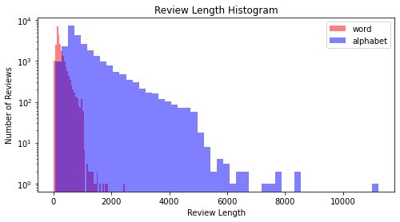
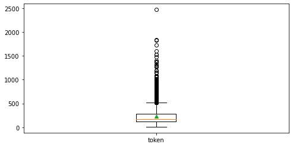
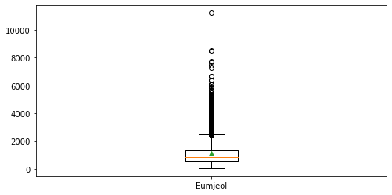
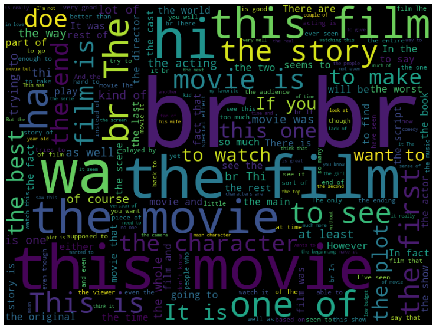
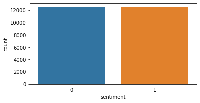

# Similarity & EDA

## Similarity

### TF-IDF Vector Similarity

> 데이터를 입력하고 TF-IDF형태로 변환한다.

```python
import numpy as np
from sklearn.feature_extraction.text import TfidfVectorizer

sent = ("휴일 인 오늘 도 서쪽 을 중심 으로 폭염 이 이어졌는데요, 내일 은 반가운 비 소식 이 있습니다.", 
        "폭염 을 피해서 휴일 에 놀러왔다가 갑작스런 비 로 인해 망연자실 하고 있습니다.") 

tfidf_vectorizer = TfidfVectorizer()
tfidf_matrix = tfidf_vectorizer.fit_transform(sent).toarray()
print(np.round(tfidf_matrix, 3))
```

```
array([[0.   , 0.324, 0.   , 0.   , 0.324, 0.324, 0.324, 0.324, 0.324,
        0.324, 0.   , 0.231, 0.324, 0.231, 0.   , 0.   , 0.231],
       [0.365, 0.   , 0.365, 0.365, 0.   , 0.   , 0.   , 0.   , 0.   ,
        0.   , 0.365, 0.259, 0.   , 0.259, 0.365, 0.365, 0.259]])
```


#### Jaccard Similarity

> 전체 단어들의 합집합의 개수 중 같은 단어를 포함한 교집합의 개수의 비율을 거리개념으로 설명한 것이 Jaccard similarity이다.

```python
sent_1 = set(sent[0].split())
sent_2 = set(sent[1].split())
print(sent_1)
print(sent_2)
```

```
{'서쪽', '을', '소식', '중심', '인', '으로', '휴일', '오늘', '폭염', '내일', '이', '은', '반가운', '비', '도', '이어졌는데요,', '있습니다.'}

{'하고', '을', '로', '에', '놀러왔다가', '휴일', '폭염', '망연자실', '비', '갑작스런', '피해서', '있습니다.', '인해'}
```


> 합집합과 교집합을 구한다.

```python
hap_set = sent_1 | sent_2 # 합집합
gyo_set = sent_1 & sent_2 # 교집합
print(hap_set, '\n')
print(gyo_set, '\n')
```

```
{'중심', '로', '놀러왔다가', '망연자실', '비', '갑작스런', '도', '피해서', '하고', '서쪽', '을', '소식', '인', '에', '으로', '휴일', '오늘', '폭염', '내일', '이', '은', '반가운', '이어졌는데요,', '있습니다.', '인해'} 

{'을', '휴일', '폭염', '비', '있습니다.'} 
```

```python
jaccard = len(gyo_set) / len(hap_set)
print(jaccard)
```

```
0.2
```


#### Cosine similarity

> 코사인 유사도로 측정한 거리이다. scikit-learn의 패키지로 구현 가능하다.

```python
from sklearn.metrics.pairwise import cosine_similarity
d = cosine_similarity(tfidf_matrix[0:1], tfidf_matrix[1:2])
print(d)
```

```
[[0.17952266]]
```


#### Euclidean similarity

> 유클리드 거리로 측정한 유사도이다. scikit-learn의 패키지로 구현 가능하다.

```python
from sklearn.metrics.pairwise import euclidean_distances

euclidean_distances(tfidf_matrix[0:1], tfidf_matrix[1:2])
```

```
array([[1.28099753]])
```


#### Manhattan similarity

> 맨해튼 거리로 측정한 유사도이다. scikit-learn의 패키지로 구현 가능하다. 정규화하여 사용해본다.

```python
def l1_normalize(v):
    return v / np.sum(v)

tfidf_norm_l1 = l1_normalize(tfidf_matrix)
d = euclidean_distances(tfidf_norm_l1[0:1], tfidf_norm_l1[1:2])
print(d)

from sklearn.metrics.pairwise import manhattan_distances

d = manhattan_distances(tfidf_norm_l1[0:1], tfidf_norm_l1[1:2])
print(d)
```

```
[[0.20491229]]

[[0.77865927]]
```


한 가지 알아야 할 것은, python에서 similarity함수들을 사용할 때 indexing을 [1:2]와 같이 해주어야 한다는 점이다. 예를 들어 코사인 유사도를 계산할 때 tfidf_matrix[0:1]이 아닌 tfidf_matrix[0] 혹은 tfidf_matrix[0,:]과같이 indexing하면 shape이 (1,17)이 아닌 (17,)형태가 되어 reshape을 필요로 한다. 왜냐하면 함수들은 2D array를 input으로 받기 때문이다.


### Hash Vector Similarity

> 데이터를 입력하고 Hash vector화한다.

```python
import numpy as np
from sklearn.feature_extraction.text import HashingVectorizer

sent = ("휴일 인 오늘 도 서쪽 을 중심 으로 폭염 이 이어졌는데요, 내일 은 반가운 비 소식 이 있습니다.", 
        "폭염 을 피해서 휴일 에 놀러왔다가 갑작스런 비 로 인해 망연자실 하고 있습니다.") 

# 카운트 기반의 Hash vectorize
VOCAB_SIZE = 20
hvectorizer = HashingVectorizer(n_features=VOCAB_SIZE,norm=None,alternate_sign=False)
hash_matrix = hvectorizer.fit_transform(sent).toarray()
print(hash_matrix)

# L2 normalization기반의 Hash vectorize
VOCAB_SIZE = 20
hvectorizer = HashingVectorizer(n_features=VOCAB_SIZE,norm='l2',alternate_sign=False)
hash_matrix = hvectorizer.fit_transform(sent).toarray()
print(np.round(hash_matrix, 3))
```

```
[[0. 2. 0. 0. 0. 1. 1. 1. 1. 0. 0. 0. 2. 2. 0. 1. 0. 0. 0. 0.]
 [0. 2. 1. 0. 0. 1. 1. 0. 0. 0. 1. 0. 0. 0. 0. 0. 2. 1. 0. 0.]]
 
 [[0.    0.485 0.    0.    0.    0.243 0.243 0.243 0.243 0.    0.    0.
  0.485 0.485 0.    0.243 0.    0.    0.    0.   ]
 [0.    0.555 0.277 0.    0.    0.277 0.277 0.    0.    0.    0.277 0.
  0.    0.    0.    0.    0.555 0.277 0.    0.   ]]
```


#### Jaccard Similarity

> 단어별로 분리한다.

```python
sent_1 = set(sent[0].split())
sent_2 = set(sent[1].split())
print(sent_1)
print(sent_2)
```

```
{'서쪽', '을', '소식', '중심', '인', '으로', '휴일', '오늘', '폭염', '내일', '이', '은', '반가운', '비', '도', '이어졌는데요,', '있습니다.'}

{'하고', '을', '로', '에', '놀러왔다가', '휴일', '폭염', '망연자실', '비', '갑작스런', '피해서', '있습니다.', '인해'}
```


> 합집합과 교집합을 구해 비율을 계산한다.

```python
hap_set = sent_1 | sent_2
gyo_set = sent_1 & sent_2
print(hap_set, '\n')
print(gyo_set, '\n')

jaccard = len(gyo_set) / len(hap_set)
print(jaccard)
```

```
{'중심', '로', '놀러왔다가', '망연자실', '비', '갑작스런', '도', '피해서', '하고', '서쪽', '을', '소식', '인', '에', '으로', '휴일', '오늘', '폭염', '내일', '이', '은', '반가운', '이어졌는데요,', '있습니다.', '인해'} 

{'을', '휴일', '폭염', '비', '있습니다.'} 

0.2
```


#### Cosine Similarity

```python
from sklearn.metrics.pairwise import cosine_similarity
d = cosine_similarity(hash_matrix[0:1], hash_matrix[1:2])
print(d)
```

```
[[0.40360368]]
```


#### Euclidean Similarity

```python
from sklearn.metrics.pairwise import euclidean_distances

euclidean_distances(hash_matrix[0:1], hash_matrix[1:2])
```

```
array([[1.09215047]])
```


#### Manhattan Similarity

```python
from sklearn.metrics.pairwise import manhattan_distances

d = manhattan_distances(tfidf_norm_l1[0:1], tfidf_norm_l1[1:2])
print(d)
```

```
[[0.77865927]]
```


## NLP EDA

### Preprocessing

> 필요한 패키지들과 데이터셋을 불러온다.

```python
import os
import pandas as pd
import tensorflow as tf

# 영화 리뷰 데이터 불러오기
data_set = tf.keras.utils.get_file(
      fname="imdb.tar.gz", 
      origin="http://ai.stanford.edu/~amaas/data/sentiment/aclImdb_v1.tar.gz", 
      extract=True)
```


> dataset의 path와 파일이름들을 본다.

```python
data_path = os.path.dirname(data_set)
print(data_path)

aclimdb = os.path.join(data_path, "aclimdb/test/neg")
print(aclimdb)

file_name = os.listdir(aclimdb)
print(file_name[:20])
```

```
C:\Users\soohan\.keras\datasets

C:\Users\soohan\.keras\datasets\aclimdb/test/neg

['0_2.txt', '10000_4.txt', '10001_1.txt', '10002_3.txt', '10003_3.txt', '10004_2.txt', '10005_2.txt', '10006_2.txt', '10007_4.txt', '10008_4.txt', '10009_3.txt', '1000_3.txt', '10010_2.txt', '10011_1.txt', '10012_1.txt', '10013_4.txt', '10014_2.txt', '10015_4.txt', '10016_3.txt', '10017_1.txt']
```


> 학습 데이터를 읽어와 데이터프레임에 저장한다.

```python
def directory_data(directory):
    data = {}
    data["review"] = []
    for file_path in os.listdir(directory):
        with open(os.path.join(directory, file_path), "r", encoding='utf-8') as file:
            data["review"].append(file.read())
            
    return pd.DataFrame.from_dict(data)

def data(directory):
    pos_df = directory_data(os.path.join(directory, "pos"))
    neg_df = directory_data(os.path.join(directory, "neg"))
    pos_df["sentiment"] = 1
    neg_df["sentiment"] = 0
    
    return pd.concat([pos_df, neg_df])

train_df = data(os.path.join(os.path.dirname(data_set), "aclImdb", "train"))
test_df = data(os.path.join(os.path.dirname(data_set), "aclImdb", "test"))
train_df.head()
reviews = list(train_df['review'])
print(reviews[0])
```

```
Bromwell High is a cartoon comedy. It ran at the same time as some other programs about school life, such as "Teachers". My 35 years in the teaching profession lead me to believe that Bromwell High's satire is much closer to reality than is "Teachers". The scramble to survive financially, the insightful students who can see right through their pathetic teachers' pomp, the pettiness of the whole situation, all remind me of the schools I knew and their students. When I saw the episode in which a student repeatedly tried to burn down the school, I immediately recalled ......... at .......... High. A classic line: INSPECTOR: I'm here to sack one of your teachers. STUDENT: Welcome to Bromwell High. I expect that many adults of my age think that Bromwell High is far fetched. What a pity that it isn't!
```


> tokenize하고 붙여서 음절의 길이를 저장한다.

```python
tokenized_reviews = [r.split() for r in reviews]
print(tokenized_reviews[0])

review_len_by_token = [len(t) for t in tokenized_reviews]
print(review_len_by_token[:10])

review_len_by_eumjeol = [len(s.replace(' ', '')) for s in reviews]
remove_space = [s.replace(' ', '') for s in reviews]
print(remove_space[0])
print(review_len_by_eumjeol[:20])
```

```
# tokenize
['Bromwell', 'High', 'is', 'a', 'cartoon', 'comedy.', 'It', 'ran', 'at', 'the', 'same', 'time', 'as', 'some', 'other', 'programs', 'about', 'school', 'life,', 'such', 'as', '"Teachers".', 'My', '35', 'years', 'in', 'the', 'teaching', 'profession', 'lead', 'me', 'to', 'believe', 'that', 'Bromwell', "High's", 'satire', 'is', 'much', 'closer', 'to', 'reality', 'than', 'is', '"Teachers".', 'The', 'scramble', 'to', 'survive', 'financially,', 'the', 'insightful', 'students', 'who', 'can', 'see', 'right', 'through', 'their', 'pathetic', "teachers'", 'pomp,', 'the', 'pettiness', 'of', 'the', 'whole', 'situation,', 'all', 'remind', 'me', 'of', 'the', 'schools', 'I', 'knew', 'and', 'their', 'students.', 'When', 'I', 'saw', 'the', 'episode', 'in', 'which', 'a', 'student', 'repeatedly', 'tried', 'to', 'burn', 'down', 'the', 'school,', 'I', 'immediately', 'recalled', '.........', 'at', '..........', 'High.', 'A', 'classic', 'line:', 'INSPECTOR:', "I'm", 'here', 'to', 'sack', 'one', 'of', 'your', 'teachers.', 'STUDENT:', 'Welcome', 'to', 'Bromwell', 'High.', 'I', 'expect', 'that', 'many', 'adults', 'of', 'my', 'age', 'think', 'that', 'Bromwell', 'High', 'is', 'far', 'fetched.', 'What', 'a', 'pity', 'that', 'it', "isn't!"]

# tokenize length list
[140, 428, 147, 124, 120, 171, 108, 340, 436, 324]

# remove space
BromwellHighisacartooncomedy.Itranatthesametimeassomeotherprogramsaboutschoollife,suchas"Teachers".My35yearsintheteachingprofessionleadmetobelievethatBromwellHigh'ssatireismuchclosertorealitythanis"Teachers".Thescrambletosurvivefinancially,theinsightfulstudentswhocanseerightthroughtheirpatheticteachers'pomp,thepettinessofthewholesituation,allremindmeoftheschoolsIknewandtheirstudents.WhenIsawtheepisodeinwhichastudentrepeatedlytriedtoburndowntheschool,Iimmediatelyrecalled.........at..........High.Aclassicline:INSPECTOR:I'mheretosackoneofyourteachers.STUDENT:WelcometoBromwellHigh.IexpectthatmanyadultsofmyagethinkthatBromwellHighisfarfetched.Whatapitythatitisn't!

# remove space length
[667, 1939, 695, 540, 528, 847, 521, 1845, 2170, 1537, 1299, 388, 1348, 1027, 626, 718, 908, 1554, 631, 676]
```


###  Visualization

> 필요한 패키지를 불러와 문장의 크기 분포 히스토그램을 그린다.

```python
import matplotlib.pyplot as plt
plt.figure(figsize=(8, 4))
plt.hist(review_len_by_token, bins=50, alpha=0.5, color= 'r', label='word')
plt.hist(review_len_by_eumjeol, bins=50, alpha=0.5, color='b', label='alphabet')
plt.legend()
plt.yscale('log', nonposy='clip')
plt.title('Review Length Histogram')
plt.xlabel('Review Length')
plt.ylabel('Number of Reviews')
plt.show()
```




> 기술통계량을 본다.

```python
import numpy as np

print('문장 최대길이: {}'.format(np.max(review_len_by_token)))
print('문장 최소길이: {}'.format(np.min(review_len_by_token)))
print('문장 평균길이: {:.2f}'.format(np.mean(review_len_by_token)))
print('문장 길이 표준편차: {:.2f}'.format(np.std(review_len_by_token)))
print('문장 중간길이: {}'.format(np.median(review_len_by_token)))

# 사분위
print('제 1 사분위 길이: {}'.format(np.percentile(review_len_by_token, 25)))
print('제 3 사분위 길이: {}'.format(np.percentile(review_len_by_token, 75)))
```

```
문장 최대길이: 2470
문장 최소길이: 10
문장 평균길이: 233.79
문장 길이 표준편차: 173.73
문장 중간길이: 174.0
제 1 사분위 길이: 127.0
제 3 사분위 길이: 284.0
```


> 단어와 문자 분포의 Boxplot을 그린다.

```python
plt.figure(figsize=(8, 4))
plt.boxplot([review_len_by_token], labels=['token'], showmeans=True)
plt.show()

plt.figure(figsize=(8, 4))
plt.boxplot([review_len_by_eumjeol], labels=['Eumjeol'], showmeans=True)
plt.show()
```






> Word Cloud를 그려본다. 그리기 전에 Stopword를 제외한다.

```python
from wordcloud import WordCloud, STOPWORDS
import matplotlib.pyplot as plt

wordcloud = WordCloud(stopwords = STOPWORDS, background_color = 'black', width = 800, height = 600)\
                .generate(' '.join(train_df['review']))

plt.figure(figsize = (15, 10))
plt.imshow(wordcloud)
plt.axis("off")
plt.show()
```




> 긍정 부정 분포 확인하기

```python
import seaborn as sns
import matplotlib.pyplot as plt

sentiment = train_df['sentiment'].value_counts()
fig, axe = plt.subplots(ncols=1)
fig.set_size_inches(6, 3)
sns.countplot(train_df['sentiment'])
plt.show()

print(sentiment)
```



```
1    12500
0    12500
Name: sentiment, dtype: int64
```

