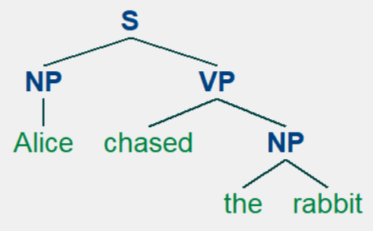

# Information Extraction from Text

## Chunking

> 여러 개의 품사로 구(phrase)를 만드는 것을 chunking이라고 한다.
>
> 또한 이렇게 묶인 구(phrase)를 chunk라고 한다.

```python
sentence= [("the","DT"), ("little", "JJ"), ("yellow","JJ"),
           ("dog","NN"), ("barked","VBD"), ("at","IN"),
           ("the", "DT"), ("cat", "NN")]

grammar= "NP: {<DT>?<JJ>*<NN>}"

cp= nltk.RegexpParser(grammar)
result= cp.parse(sentence)
print(result)
```

```
(S
  (NP the/DT little/JJ yellow/JJ dog/NN)
  barked/VBD
  at/IN
  (NP the/DT cat/NN))
```


```python
result.draw()
```


```python
grammar= """
    NP: {<DT|PP\$>?<JJ>*<NN>}
        {<NNP>}
"""

cp= nltk.RegexpParser(grammar)
sentence= [("Rapunzel", "NNP"), ("let","VBD"), ("down","RP"),
           ("her", "PP$"), ("long","JJ"), ("golden","JJ"),
           ("hair", "NN")]

result= cp.parse(sentence)
print(result)
```

```
(S
  (NP Rapunzel/NNP)
  let/VBD
  down/RP
  (NP her/PP$ long/JJ golden/JJ hair/NN))
```


```python
result.draw()
```


```python
nouns= [("money","NN"), ("market","NN"),("fund","NN")]
grammar= "NP: {<NN><NN>} # Chunk two consecutive nouns"
cp= nltk.RegexpParser(grammar)
print(cp.parse(nouns))
```

```
(S (NP money/NN market/NN) fund/NN)
```


```python
sentence= [("the","DT"), ("little","JJ"),("yellow","JJ"),
           ("dog","NN"),("barked","VBD"),("at","IN"),
           ("the","DT"),("cat","NN")]

grammar= "NP: {<DT>?<JJ>*<NN>}"
cp= nltk.RegexpParser(grammar)
tree= cp.parse(sentence)
print(tree)
```

```
(S
  (NP the/DT little/JJ yellow/JJ dog/NN)
  barked/VBD
  at/IN
  (NP the/DT cat/NN))
```

> tree들의 subtree POS확인하기

```python
for subtree in tree.subtrees():
    print(subtree.label())
```

```
S
NP
NP
```

> 원하는 형태의 시퀀스 발췌하기

```python
cp= nltk.RegexpParser('CHUNK: {<V.*> <TO> <V.*>}')
brown= nltk.corpus.brown
i=0
for sent in brown.tagged_sents():
    tree= cp.parse(sent)
    for subtree in tree.subtrees():
        if subtree.label() == "CHUNK":
            print(subtree)
            i += 1
    if i > 10: break
```

```
(CHUNK combined/VBN to/TO achieve/VB)
(CHUNK continue/VB to/TO place/VB)
(CHUNK serve/VB to/TO protect/VB)
(CHUNK wanted/VBD to/TO wait/VB)
(CHUNK allowed/VBN to/TO place/VB)
(CHUNK expected/VBN to/TO become/VB)
(CHUNK expected/VBN to/TO approve/VB)
(CHUNK expected/VBN to/TO make/VB)
(CHUNK intends/VBZ to/TO make/VB)
(CHUNK seek/VB to/TO set/VB)
(CHUNK like/VB to/TO see/VB)
```


#### Chinking

> 특정 부분을 chunk 밖으로 빼내는 것을 chinking이라고 한다. chink는 문장에서 chunk를 제외한 나머지 부분을 의미한다.

```python
grammar= r"""
    NP:
    {<.*>+} # CHUNK everything
    }<VBD|IN>+{
"""

sentence= [("the","DT"), ("little","JJ"),("yellow","JJ"),
           ("dog","NN"),("barked","VBD"),("at","IN"),
           ("the","DT"),("cat","NN")]
cp= nltk.RegexpParser(grammar)
print(cp.parse(sentence))
```

```
(S
  (NP the/DT little/JJ yellow/JJ dog/NN)
  barked/VBD
  at/IN
  (NP the/DT cat/NN))
```

#### Chunked Sentence

> 사전에 chunking된 사전

```python
from nltk.corpus import conll2000

print(conll2000.chunked_sents('train.txt')[99])
```

```
(S
  (PP Over/IN)
  (NP a/DT cup/NN)
  (PP of/IN)
  (NP coffee/NN)
  ,/,
  (NP Mr./NNP Stone/NNP)
  (VP told/VBD)
  (NP his/PRP$ story/NN)
  ./.)
```

```python
print(conll2000.chunked_sents('train.txt', chunk_types=['NP'])[99])
```

```
(S
  Over/IN
  (NP a/DT cup/NN)
  of/IN
  (NP coffee/NN)
  ,/,
  (NP Mr./NNP Stone/NNP)
  told/VBD
  (NP his/PRP$ story/NN)
  ./.)
```

> test.txt로 chunk 성능을 평가한다.

```python
test_sents= conll2000.chunked_sents('test.txt', chunk_types=['NP'])
grammar= r"NP: {<[CDJNP].*>+}"
cp= nltk.RegexpParser(grammar)
score= cp.evaluate(test_sents)
print(score)
```

```
ChunkParse score:
    IOB Accuracy:  87.7%%
    Precision:     70.6%%
    Recall:        67.8%%
    F-Measure:     69.2%%
```

>여러 척도들을 score의 메서드들로 조회가 가능하다.

```python
score.accuracy()
score.precision()
score.recall()
score.f_measure()
```

#### Recursion in Linguistic Structure

> 문법에 절(clause)을 정의함

```python
grammar= r"""
    NP: {<DT|JJ|NN.*>+}
    PP: {<IN><NP>}
    VP: {<VB.*><NP|PP|CLAUSE>+$}
    CLAUSE: {<NP><VP>}
    """
cp= nltk.RegexpParser(grammar)
sentence= [("Mary","NN"),("saw","VBD"),("the","DT"),("cat","NN"),
           ("sit","VB"),("on","IN"),("the","DT"),("mat","NN")]
print(cp.parse(sentence))
```

```
(S
  (NP Mary/NN)
  saw/VBD
  (CLAUSE
    (NP the/DT cat/NN)
    (VP sit/VB (PP on/IN (NP the/DT mat/NN)))))
```


> Clause안에 또 다른 Clause가 들어 있는 경우 

```python
sentence= [("John", "NNP"),("thinks","VBZ"),
           ("Mary","NN"),("saw","VBD"),
           ("the","DT"),("cat","NN"),
           ("sit","VB"),
           ("on","IN"),("the","DT"),
           ("mat","NN")]
print(cp.parse(sentence))
```

```
(S
  (NP John/NNP)
  thinks/VBZ
  (NP Mary/NN)
  saw/VBD
  (CLAUSE
    (NP the/DT cat/NN)
    (VP sit/VB (PP on/IN (NP the/DT mat/NN)))))
```

```python
cp.parse(sentence).draw()
```


> loop 지정을 통한 재귀적(recursion) 분석

```python
cp= nltk.RegexpParser(grammar, loop=2)
print(cp.parse(sentence))
```

```
(S
  (NP John/NNP)
  thinks/VBZ
  (CLAUSE
    (NP Mary/NN)
    (VP
      saw/VBD
      (CLAUSE
        (NP the/DT cat/NN)
        (VP sit/VB (PP on/IN (NP the/DT mat/NN)))))))
```

```python
cd.parse(sentence).draw()
```


이와 같이 문장에 맞게 트리를 깊게 구성하는 방식을 cascaded chunking이라고 부른다.


## Trees

```python
tree1= nltk.Tree('NP', ['Alice'])
print(tree1)
```

```
(NP Alice)
```

> 문서 tree 추출

```python
tree2= nltk.Tree('NP', ['the','rabbit'])
print(tree2)
```

```
(NP the rabbit)
```


```python
tree3= nltk.Tree('VP',['chased',tree2])
tree4= nltk.Tree('S',[tree1, tree3])
print(tree4)
```

```
(S (NP Alice) (VP chased (NP the rabbit)))
```


```python
print(tree4[0])
print(tree4[1])
```

```
(NP Alice)
(VP chased (NP the rabbit))
```


```python
tree4[1].label()
```

```
'VP'
```


```python
tree4.leaves()
```

```
['Alice', 'chased', 'the', 'rabbit']
```


```python
tree4[1][1][1]
```

```
'rabbit'
```


```python
tree4.draw()
```




## Named Entity Recognition(NER) - 개체명 인식

```python
sent= nltk.corpus.treebank.tagged_sents()[22]
print(nltk.ne_chunk(sent, binary=True))
```

```
(S
  The/DT
  (NE U.S./NNP)
  is/VBZ
  one/CD
  of/IN
  the/DT
  few/JJ
  industrialized/VBN
  nations/NNS
  that/WDT
  *T*-7/-NONE-
  does/VBZ
  n't/RB
  have/VB
  a/DT
  higher/JJR
  standard/NN
  of/IN
  regulation/NN
  for/IN
  the/DT
  smooth/JJ
  ,/,
  needle-like/JJ
  fibers/NNS
  such/JJ
  as/IN
  crocidolite/NN
  that/WDT
  *T*-1/-NONE-
  are/VBP
  classified/VBN
  *-5/-NONE-
  as/IN
  amphobiles/NNS
  ,/,
  according/VBG
  to/TO
  (NE Brooke/NNP)
  T./NNP
  Mossman/NNP
  ,/,
  a/DT
  professor/NN
  of/IN
  pathlogy/NN
  at/IN
  the/DT
  (NE University/NNP)
  of/IN
  (NE Vermont/NNP College/NNP)
  of/IN
  (NE Medicine/NNP)
  ./.)
```


```python
print(nltk.ne_chunk(sent))
```

```
(S
  The/DT
  (GPE U.S./NNP)
  is/VBZ
  one/CD
  of/IN
  the/DT
  few/JJ
  industrialized/VBN
  nations/NNS
  that/WDT
  *T*-7/-NONE-
  does/VBZ
  n't/RB
  have/VB
  a/DT
  higher/JJR
  standard/NN
  of/IN
  regulation/NN
  for/IN
  the/DT
  smooth/JJ
  ,/,
  needle-like/JJ
  fibers/NNS
  such/JJ
  as/IN
  crocidolite/NN
  that/WDT
  *T*-1/-NONE-
  are/VBP
  classified/VBN
  *-5/-NONE-
  as/IN
  amphobiles/NNS
  ,/,
  according/VBG
  to/TO
  (PERSON Brooke/NNP T./NNP Mossman/NNP)
  ,/,
  a/DT
  professor/NN
  of/IN
  pathlogy/NN
  at/IN
  the/DT
  (ORGANIZATION University/NNP)
  of/IN
  (PERSON Vermont/NNP College/NNP)
  of/IN
  (GPE Medicine/NNP)
  ./.)
```

## Relation Extraction - 관계 추출

```python
from nltk.corpus import ieer
doc_ieer= ieer.parsed_docs('NYT_19980315')
print(doc_ieer[0].text[:20])

IN= re.compile(r'.*\bin\b(?!\b.+ing)')
for doc in doc_ieer:
    for rel in nltk.sem.extract_rels('ORG', 'LOC',doc,
                                     corpus= 'ieer', pattern= IN):
        print(nltk.sem.rtuple(rel))
```

```
['For', 'almost', Tree('DURATION', ['20', 'years']), ',', 'since', 'its', 'debut', 'in', Tree('DATE', ['1979']), ',', Tree('PERSON', ['Bob', 'Edwards']), 'has', 'presided', 'over', 'the', Tree('ORGANIZATION', ['National', 'Public', 'Radio']), 'news', 'magazine', '``Morning', "Edition.''"]
[ORG: 'WHYY'] 'in' [LOC: 'Philadelphia']
[ORG: 'McGlashan &AMP; Sarrail'] 'firm in' [LOC: 'San Mateo']
[ORG: 'Freedom Forum'] 'in' [LOC: 'Arlington']
[ORG: 'Brookings Institution'] ', the research group in' [LOC: 'Washington']
[ORG: 'Idealab'] ', a self-described business incubator based in' [LOC: 'Los Angeles']
[ORG: 'Open Text'] ', based in' [LOC: 'Waterloo']
[ORG: 'WGBH'] 'in' [LOC: 'Boston']
[ORG: 'Bastille Opera'] 'in' [LOC: 'Paris']
[ORG: 'Omnicom'] 'in' [LOC: 'New York']
[ORG: 'DDB Needham'] 'in' [LOC: 'New York']
[ORG: 'Kaplan Thaler Group'] 'in' [LOC: 'New York']
[ORG: 'BBDO South'] 'in' [LOC: 'Atlanta']
[ORG: 'Georgia-Pacific'] 'in' [LOC: 'Atlanta']
```
