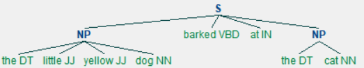

# Regular Expression(정규 표현식)

> 필요한 package들 불러오기

```python
import nltk
import re
```

## ^

```python
wordlist= [w for w in nltk.corpus.words.words('en')
           if w.islower()]

v=[w for w in wordlist if re.search('^a', w)]
print(v[:20])
```

```
['a', 'aa', 'aal', 'aalii', 'aam', 'aardvark', 'aardwolf', 'aba', 'abac', 'abaca', 'abacate', 'abacay', 'abacinate', 'abacination', 'abaciscus', 'abacist', 'aback', 'abactinal', 'abactinally', 'abaction']
```

a로 시작하는 단어들 찾기


## $

```python
v=[w for w in wordlist if re.search('ed$', w)]
print(v[:20])
```

```
['abaissed', 'abandoned', 'abased', 'abashed', 'abatised', 'abed', 'aborted', 'abridged', 'abscessed', 'absconded', 'absorbed', 'abstracted', 'abstricted', 'accelerated', 'accepted', 'accidented', 'accoladed', 'accolated', 'accomplished', 'accosted']
```

영어단어 사전에서 'ed'로 끝나는 단어들 추출


## []

```python
v= [w for w in wordlist if re.search('^[ghi][mno][jlk][def]$', w)]
print(v[:20])
```

```
['gold', 'golf', 'hold', 'hole']
```

g,h,i 중 하나, m,n,o 중 하나, j,l,k 중 하나, d,e,f 중 하나로 이루어진 단어들을 추출한 것이다.


## +

```python
chat_words= sorted(set(w for w in nltk.corpus.nps_chat.words()))
v= [w for w in chat_words if re.search('^m+i+n+e+$', w)]
print(v[:20])
```

```
['miiiiiiiiiiiiinnnnnnnnnnneeeeeeeeee', 'miiiiiinnnnnnnnnneeeeeeee', 'mine', 'mmmmmmmmiiiiiiiiinnnnnnnnneeeeeeee']
```

m 끝까지, i 끝까지, n 끝까지, e 끝까지로 이루어진 모든 mine의 조합을 추출한 것이다.


## \

```python
wsj= set(nltk.corpus.treebank.words())
v= [w for w in wsj if re.search('^[0-9]+\.[0-9]+$', w)]
print(v[:30])
```

```
['2.25', '1.26', '7.62', '236.79', '12.97', '13.65', '3.75', '5.82', '13.1', '8.60', '1.8415', '47.6', '251.2', '1.39', '8.45', '8.35', '7.2', '112.9', '63.79', '133.7', '85.1', '13.90', '6.79', '4.2', '5.6', '1.35', '6.5', '13.5', '99.3', '8.14']
```

escape code \를 사용하여 '.'의 의미를 나타내었다.


```python
v= [w for w in wsj if re.search('^[A-Z]+\$$', w)]
print(v[:20])
```

```
['US$', 'C$']
```

\\$를 이용하여 $의 의미 나타내었다.


## {}

```python
v= [w for w in wsj if re.search('^[0-9]{4}$', w)]
print(v[:20])
```

```
['1986', '1917', '1956', '1985', '1934', '2005', '1984', '1991', '1968', '1637', '1999', '2000', '1973', '1971', '1903', '1967', '1976', '1787', '1982', '1981']
```

4자리 숫자들의 조합을 모두 추출한 것이다.


```python
v= [w for w in wsj if re.search('^[0-9]+-[a-z]{3,5}$', w)]
print(v[:20])
```

```
['27-year', '36-day', '15-day', '190-point', '500-stock', '52-week', '20-stock', '21-month', '87-store', '12-year', '300-day', '150-point', '12-point', '100-share', '50-state', '30-point', '90-day', '240-page', '30-day', '14-hour']
```

0에서 9까지 숫자들의 조합, 길이가 3이상 5이하인 문자들의 조합이 -로 연결된 것들을 모두 추출함.


```python
v= [w for w in wsj if re.search('^[a-z]{5,}-[a-z]{2,3}-[a-z]{,6}$', w)]
print(v[:20])
```

```
['black-and-white', 'bread-and-butter', 'machine-gun-toting', 'savings-and-loan', 'father-in-law']
```

길이가  5이상인 문자열들의 조합, 길이가 2이상 3이하인 문자열들의 조합, 길이가 6이하인 문자열들의 조합이 모두 -로 연결된 것들을 모두 추출함.


```python
v= [w for w in wsj if re.search('(ed|ing)$', w)]
print(v[:20])
```

```
['infringed', 'covered', 'dominating', 'Illuminating', 'consulting', 'depended', 'gut-wrenching', 'sports-oriented', 'Getting', 'change-ringing', 'Alfred', 'retained', 'botched', 'appearing', 'counseling', 'sweetened', 'treating', 'war-rationed', 'U.N.-supervised', 'Winning']
```

ed 혹은 ing로 끝나는 단어들을 모두 추출함.


## 특정 형태의 단어들 추출

```python
v= [w for w in wordlist if re.search('^..j..t..$', w)]
print(v[:20])
```

```
['abjectly', 'adjuster', 'dejected', 'dejectly', 'injector', 'majestic', 'objectee', 'objector', 'rejecter', 'rejector', 'unjilted', 'unjolted', 'unjustly']
```

"..j..t.."의 형태를 가진 단어들 추출한 것이다.


## 특정 알파벳들의 조합으로만 이루어진 단어들 찾기

```python
v= [w for w in chat_words if re.search('^[ha]+$', w)]
print(v[:20])
```

```
['a', 'aaaaaaaaaaaaaaaaa', 'aaahhhh', 'ah', 'ahah', 'ahahah', 'ahh', 'ahhahahaha', 'ahhh', 'ahhhh', 'ahhhhhh', 'ahhhhhhhhhhhhhh', 'h', 'ha', 'haaa', 'hah', 'haha', 'hahaaa', 'hahah', 'hahaha']
```

a와 h로만 이루어진 단어들 모두 찾기


```python
word= 'supercalifragilisticexpialidocious'
re.findall(r'[aeiou]', word)
len(re.findall(r'[aeiou]', word))
```

```
['u','e','a','i','a','i','i','i','e','i','a','i','o','i','o','u']

16
```

해당 문자열에서 모음에 해당하는 것들을 모두 추출


## 두 모음의 조합을 포함하는 단어들의 분포

```python
wsj= sorted(set(nltk.corpus.treebank.words()))
fd= nltk.FreqDist(vs for word in wsj
                  for vs in re.findall(r'[aeiou]{2,}',
                                       word))
fd.most_common(12)
```

```
[('io', 549),
 ('ea', 476),
 ('ie', 331),
 ('ou', 329),
 ('ai', 261),
 ('ia', 253),
 ('ee', 217),
 ('oo', 174),
 ('ua', 109),
 ('au', 106),
 ('ue', 105),
 ('ui', 95)]
```


## Chunking

> 여러 개의 품사로 구(phrase)를 만드는 것을 chunking이라고 한다.
>
> 또한 이렇게 묶인 구(phrase)를 chunk라고 한다.

```python
sentence= [("the","DT"), ("little", "JJ"), ("yellow","JJ"),
           ("dog","NN"), ("barked","VBD"), ("at","IN"),
           ("the", "DT"), ("cat", "NN")]

grammar= "NP: {<DT>?<JJ>*<NN>}"

cp= nltk.RegexpParser(grammar)
result= cp.parse(sentence)
print(result)
```

```
(S
  (NP the/DT little/JJ yellow/JJ dog/NN)
  barked/VBD
  at/IN
  (NP the/DT cat/NN))
```


```python
result.draw()
```




